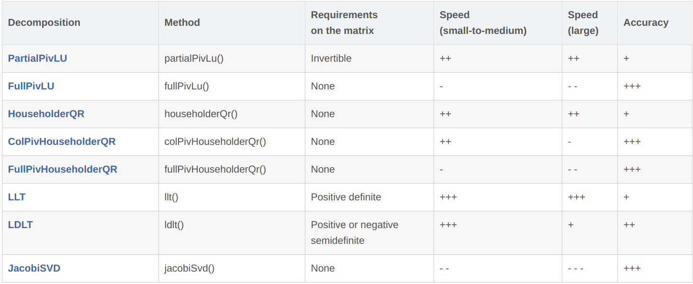
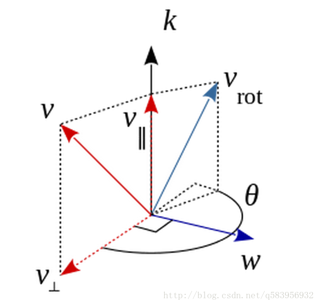

# 第二章作业

作者：曾是少年

## 二 熟悉Eigen矩阵运算

[Eigen](http://eigen.tuxfamily.org)是常用的 C++ 矩阵运算库，具有很高的运算效率。大部分需要在 C++ 中使用矩阵运算的库，都会选用 `Eigen` 作为基本代数库，例如 `Google Tensorflow`，`Google Ceres`，`GTSAM` 等。本次习题，你需要使用 `Eigen` 库，编写程序，求解一个线性方程组。为此，你需要先了解一些有关线性方程组数值解法的原理。

设线性方程`Ax = b`，在A 为方阵的前提下，请回答以下问题：
### 1. 在什么条件下，x 有解且唯一？

答：当A为方阵且A可逆（即A满秩），x有解且唯一；

### 2. 高斯消元法的原理是什么？

答：**高斯消元法**(Gaussian elimination)是求解线性方程组的一种算法，它也可用来求矩阵的秩，以及求可逆方阵的逆矩阵。它通过逐步消除未知数来将原始线性系统转化为另一个更简单的等价的系统。

**原理**：通过初等行变化将线性方程组的增广矩阵转化为行阶梯矩阵（上三角或下三角矩阵）。

**求解过程**

1. 构造增广矩阵，即系数矩阵A增加上常数向量`b(A|b)`.
2. 通过以交换行、某行乘以非负常数和两行相加这三种初等变化将原系统转化为更简单的三角形式(**`**`triangular form`**`**)  注:这里的初等变化可以通过系数矩阵A乘上初等矩阵E来实现。
3. 从而得到简化的三角方阵组，这样就容易解了
4. 最后再使用向后替换算法(Algorithm for Back Substitution)求解得。

**总结**

原线性方程组$\large \rightarrow$ 高斯消元法$\large \rightarrow$ 下三角或上三角形式的线性方程组$\large \rightarrow$前向替换算法求解(对于上三角形式，采用后向替换算法).


### 3. QR 分解的原理是什么？

答：**QR分解**

**定义**：一个矩阵$A\in R^{m\times n},m\geq n$可以被分解A=QR,其中：

* $Q\in R^{m\times m}$是正交矩阵
* $R=\left[\begin{array}{cccc}\hat{R}\\0\end{array}\right]\in R^{m\times n}$
* $\hat{R}\in R^{n \times n}$是上三角矩阵

可以看出，A=QR 这一过程将矩阵A分解为Q和R两部分，其中Q是标准正交矩阵，R是一个上三角矩阵。利用矩阵的QR分解能够简化计算，以线性系统的计算为例。
$$
Ax=b⟹(QR)x=b\\
Q^{-1} Q^Rx=Q^{-1}b⟹Rx=Q^Tb
$$
其中，Q 是一个正交矩阵，因此$Q^T$非常好计算的，R是一个上三角矩阵（相当于Gauss-Jordan消元法的前向过程结束），从下往上推就可以很快计算出线性系统的结果。

**原理**：利用２个正交矩阵的乘积一定是正交矩阵，正交矩阵的逆矩阵也是正交矩阵的特点，对正交矩阵进行多次分解，相乘。

**求解过程**

1. 对需要求解的特征值的矩阵A进行QR分解: 即$A=QR$
2. 对分解出来的结果进行逆向相乘: 即
3. 将相乘得到的矩阵进行QR分解: $$
4. 对分解出来的结果进行逆向相乘

**意义**：使用QR分解有助于加快解方程或求解速度即收敛速度


### 4. Cholesky 分解的原理是什么？

答：**cholesky分解**

**定义**：如果矩阵A为n阶对称正定矩阵，则存在一个对角元素为正数的下三角实矩阵L，使得：$A=LL^T$，当限定L的对角元素为正时，这种分解是唯一的，称为Cholesky分解。

把一个对称正定的矩阵表示成一个下三角矩阵L和其转置的乘积的分解。它要求矩阵的所有特征值必须大于零，故分解的下三角的对角元也是大于零的。Cholesky分解法又称平方根法，是当A为实对称正定矩阵时，LU三角分解法的变形。


### 5. 编程实现A 为100 $\times$ 100 随机矩阵时，用QR 和Cholesky 分解求x 的程序。

你可以参考本次课用到的`useEigen` 例程。提示：你可能需要参考相关的数学书籍或文章。请善用搜索引擎。Eigen 固定大小矩阵最大支持到50，所以你会用到动态大小的矩阵。

答：

Eigen中有现成的代数库,因此可以直接调用,关于矩阵分解的函数如下:



整体过程如下:

1. 创建并初始化随机矩阵, (使用动态矩阵创建)

```C++
    // 对A,b初始化;
    int rows = 100;
    int cols = 100;
    static default_random_engine e(time(0));
    static normal_distribution<double> n(0,10);
    Eigen::Matrix<double,Eigen::Dynamic,Eigen::Dynamic> A(rows,cols);
    Eigen::Matrix<double,Eigen::Dynamic,1> b(rows,1);
	//随机赋值
    for(int x = 0;x<rows;x++)
    {
        b(x,0) = random()%10;
        for(int y = 0;y<cols;y++)
            A(x,y) = abs(n(e));
    }
```

2. 调用QR分解求解方程组代码如下:

```C++
    Eigen::Matrix<double,Eigen::Dynamic,1> x_qr(rows,1);
    x_qr = A.colPivHouseholderQr().solve(b);
    cout<<"original: x_qr:"<<endl<<x_qr<<endl;
```

3. 调用Cholesky分解求解方程组代码如下:

```C++
    Eigen::Matrix<double,Eigen::Dynamic,1> x_cholesky1(rows,1);
    x_cholesky1 = A.llt().solve(b);
    cout<<"original : x_cholesky1:"<<endl<<x_cholesky1<<endl;
```

实验结果:以3*3的矩阵测试为例: 

输出结果如下:

```cmd
guoben@guoben-WRT-WX9:~/Project/useEigen/bin$ ./useEigen 
A:
 -3.63839 -0.279217   8.07804
 -22.7538   14.1149   5.92393
 -11.9139  -3.94803   1.81077
b:
3
6
7
orginal: x 
-0.444675
-0.358359
 0.158707
 
original: x_qr:
-0.444675
-0.358359
 0.158707
 
original : x_cholesky1:
  10.4221
-0.609405
 -1.94972
```

此时观察结果发现,这个随机矩阵通过QR分解和通过chlosky分解求解得到的矩阵结果并不相同;这是因为**A不是对称正定矩阵**.于是我重新生成一个对称正定矩阵.重新运行程序,结果如下:

```C++
A = A*A.transpose(); //加入该行保证A的半正定性
```

得到结果如下:

```C++
A:
1245.09  165.77 790.353
 165.77 30.5606  112.37
790.353  112.37 618.909
b:
3
6
7
orginal: x 
-0.0872187
  0.656756
0.00344748
original: x_qr:
-0.0872187
  0.656756
0.00344748
original : x_cholesky1:
-0.0872187
  0.656756
0.00344748
```

此时, 就可以获得一致的求解结果。


## 三 几何运算练习

下面我们来练习如何使用 `Eigen/Geometry` 计算一个具体的例子。
设有小萝卜1一号和小萝卜二号位于世界坐标系中。小萝卜一号的位姿为：$q1 = [0.55, 0.3, 0.2, 0.2]$,  $t1 = [0.7, 1.1, 0.2]^T$（q 的第一项为实部）。这里的 q 和 t 表达的是 $T_{cw}$，也就是世界到相机的变换关系。小萝卜二号的位姿为 $q2 = [−0.1, 0.3, −0.7, 0.2], t2 = [−0.1, 0.4, 0.8]^T$ 。现在，小萝卜一号看到某个点在自身的坐标系下，坐标为 $p_1 = [0.5, −0.1, 0.2]^T$ ，**求该向量在小萝卜二号坐标系下的坐标。**请编程实现此事，并提交你的程序。

提示：

1.	四元数在使用前需要归一化。
2.	请注意 `Eigen` 在使用四元数时的虚部和实部顺序。
3.	参考答案为 $p2 = [1.08228, 0.663509, 0.686957]^T$。你可以用它验证程序是否正确。

**答:** 

本题中整题过程如下:

1. 对四元数进行归一化;
2. 求解两个机器人之间的变换矩阵;

涉及到的变换过程可通过下式看出：
$$
T_{wc_1} P_1 = T_{wc_2} P_2\\
P_2 = T_{wc_2}^{-1}T_{wc_1}P_1\\
P_2 = T_{cw_2}T_{cw_1}^{-1}P_1
$$

代码实现如下所示:

```C++
#include <eigen3/Eigen/Geometry>
#include<iostream>

using namespace std;
using namespace Eigen;

int main()
{
    //机器人一号的位置姿态
    Quaterniond q1(0.55,0.3,0.2,0.2);
    Vector3d t1(0.7,1.1,0.2);
    //机器人二号的位置姿态
    Quaterniond q2(-0.1,0.3,-0.7,0.2);
    Vector3d t2(-0.1,0.4,0.8);

    //四元数的归一化
    q1.normalize();
    q2.normalize();
	
    Vector3d p1(0.5,-0.1,0.2);
    Vector4d p1a;
    p1a<<p1,1;
    
    //构建T_cw_1
    Matrix4d T_cw_1;
    T_cw_1 << q1.toRotationMatrix() ,t1,
              0,0,0,1;
    cout<<"T_cw_1:"<<endl<<T_cw_1<<endl;

    //构建T_cw_2
    Matrix4d T_cw_2;
    T_cw_2 <<q2.toRotationMatrix(),t2,
            0,0,0,1;
    cout<<"T_cw_2:"<<endl<<T_cw_2<<endl;

    Vector4d p2a;
    // p2a = T_cw_2.inverse() * T_cw_1 *p1a;
    p2a = T_cw_2 * T_cw_1.inverse() *p1a;
    
    Vector3d p2;
    p2 = p2a.block(0,0,3,1);
    cout<<"p2:"<<endl<<p2<<endl;
    return 0;
}
```

程序结果如下:

```cmd
guoben@guoben-WRT-WX9:~/Project/useGeometry/bin$ ./useGeometry 
T_cw_1:
 0.661376  -0.21164  0.719577       0.7
 0.719577  0.449735 -0.529101       1.1
 -0.21164  0.867725  0.449735       0.2
        0         0         0         1
T_cw_2:
 -0.68254 -0.603175  0.412698      -0.1
-0.730159  0.587302 -0.349206       0.4
-0.031746 -0.539683  -0.84127       0.8
        0         0         0         1
p2:
 1.08228
0.663509
0.686957
```

---

视觉SLAM十四讲中采用了`Isometry3d`,值得学习.

其中,构造变换矩阵的方法更加简单方便 ,如下:

```C++
Isometry3d T1w(q1), T2w(q2);
T1w.pretranslate(t1);
T2w.pretranslate(t2);

p2 = T2w * T1w.inverse() * p1;
```


## 四 旋转的表达

课程中提到了旋转可以用旋转矩阵、旋转向量与四元数表达，其中旋转矩阵与四元数是日常应用中常见的表达方式。请根据课件知识，完成下述内容的证明。

### 1. 设有旋转矩阵 R，证明 $R^T R = I$ 且 $det R = +1^2$。

**证明**： 首先考虑旋转。设某个单位正交基$(e1; e2; e3)$ 经过一次旋转变成了$(e'_1; e'_2; e'_3)$。则**旋转矩阵R**如下所示：
$$
R
= \left[\begin{array}{cccc} e_1^T\\e_2^T\\e_3^T\end{array}\right]\left[\begin{array}{cccc} e_1' & e_2' & e_3'\end{array}\right]\\
=\left[\begin{array}{cccc} e_1^Te'_1 & e_1^Te'_2 & e_1^Te'_3\\e_2^Te'_1 & e_2^Te'_2 & e_2^Te'_3\\e_3^Te'_1 & e_3^Te'_2 & e_3^Te'_3\\\end{array}\right]
$$

对于任意i,有$e_i^T*e_i=1$,且 $e_i^T*e_j=0,(i\neq j)$，因此有
$$
\begin{align}R^T R &

= \left[\begin{array}{cccc} e_1^Te'_1 & e_2^Te'_1 & e_3^Te'_1\\e_1^Te'_2 & e_2^Te'_2 & e_3^Te'_2\\e_1^Te'_3 & e_2^Te'_3 & e_3^Te'_3\\\end{array}\right]\left[\begin{array}{cccc} e_1^Te'_1 & e_1^Te'_2 & e_1^Te'_3\\e_2^Te'_1 & e_2^Te'_2 & e_2^Te'_3\\e_3^Te'_1 & e_3^Te'_2 & e_3^Te'_3\\\end{array}\right]\\&

=\{\left[\begin{array}{cccc} e_1^T\\e_2^T\\e_3^T\end{array}\right]\left[\begin{array}{cccc} e_1' & e_2' & e_3'\end{array}\right]\}^T\left[\begin{array}{cccc} e_1^T\\e_2^T\\e_3^T\end{array}\right]\left[\begin{array}{cccc} e_1' & e_2' & e_3'\end{array}\right]\\&

=\left[\begin{array}{cccc} e_1'^T \\ e_2'^T \\ e_3'^T\end{array}\right]\left[\begin{array}{cccc} e_1 & e_2 & e_3\end{array}\right]\left[\begin{array}{cccc} e_1^T\\e_2^T\\e_3^T\end{array}\right]\left[\begin{array}{cccc} e_1' & e_2' & e_3'\end{array}\right]\\&

=I\end{align}
$$
由于：$RR^T=I$, 因此 $|I|=|RR^T|=|R||R^T|=|R|^2$,所以$det(R)=\pm 1$


### 2. 设有四元数 q，我们把虚部记为 ε，实部记为 η，那么 $q = (ε, η)$。请说明 ε 和 η 的维度。

**答：**四元数 q 有三个虚部和一个实部。即$q=q_0+q_1i+q_2j+q_3k$

因此，$\varepsilon$ 的维度为 3，$\eta$ 的维度为 1 。

 

### 3, 定义运算 + 和 ⊕ 为：

$$
q^{+}=
\left[\begin{array}{cccc} 
\eta 1 +\epsilon^{\times} & \varepsilon\\
-\varepsilon^T & \eta\\
\end{array}\right],

q^{⊕} =
\left[\begin{array}{cccc} 
\eta 1-\epsilon^{\times} & \varepsilon\\
-\varepsilon^T & \eta\\
\end{array}\right]
$$
其中运算 × 含义与 ∧ 相同，即取 ε 的反对称矩阵（它们都成叉积的矩阵运算形式），1 为单位矩阵。请证明对任意单位四元数 q1, q2，四元数乘法可写成矩阵乘法：
$$
q_1q_2 = q_1^+q_2
$$
或者
$$
q_1q_2 = q_2^⊕q_1.
$$

**证明：** 
$$
q_1 =
\left[\begin{array}{cccc} 
\varepsilon_1\\
\eta_1\\
\end{array}\right]

q_2 =
\left[\begin{array}{cccc} 
\varepsilon_2\\
\eta_2\\
\end{array}\right]
$$

$$
q_1 q_2=
\left[\begin{array}{cccc} 
\eta_1\varepsilon_2 + \eta_1\varepsilon_2 +\varepsilon_1 \times \varepsilon_2 \\
\eta_1\eta_2-\varepsilon_1^T\varepsilon_2\\
\end{array}\right]
$$

$$
q_1^{+}q_2=
\left[\begin{array}{cccc} 
\eta_1 1+\varepsilon_1^{\times} & \varepsilon_1\\
-\varepsilon_1^T & \eta_1\\
\end{array}\right]

\left[\begin{array}{cccc} 
\varepsilon_2 \\ \eta_2
\end{array}\right]

=
\left[\begin{array}{cccc} 
(\eta_1 1+\varepsilon_1^{\times})*\varepsilon_2+\varepsilon_1*\eta_2
\\
\eta_1*\eta_2-\varepsilon_1^T*\varepsilon_2

\end{array}\right]
=
\left[\begin{array}{cccc} 
\eta_1 *\varepsilon_2 +\varepsilon_1*\eta_2 +\varepsilon_1{\times}\varepsilon_2
\\
\eta_1*\eta_2-\varepsilon_1^T*\varepsilon_2

\end{array}\right]
=q_1q_2
$$

$$
q_2^{⊕}q_1=
\left[\begin{array}{cccc} 
\eta_2 1 - \varepsilon_2^{\times} & \varepsilon_2\\
-\varepsilon_2^T & \eta_2\\
\end{array}\right]

\left[\begin{array}{cccc} 
\varepsilon_1 \\ \eta_1
\end{array}\right]
=
\left[\begin{array}{cccc} 
\eta_1 *\varepsilon_2 +\varepsilon_1*\eta_2 -\varepsilon_2{\times}\varepsilon_1
\\
\eta_1*\eta_2-\varepsilon_2^T*\varepsilon_1

\end{array}\right]
=
\left[\begin{array}{cccc} 
\eta_1 *\varepsilon_2 +\varepsilon_1*\eta_2 +\varepsilon_1{\times}\varepsilon_2
\\
\eta_1*\eta_2-\varepsilon_1^T*\varepsilon_2

\end{array}\right]
=q_1q_2
$$

其中: 

$\varepsilon^T_2*\varepsilon_1 = \varepsilon^T_1*\varepsilon_2$  (1*1矩阵，转置等于其本身)；

$ \varepsilon_1^{\times}*\varepsilon_2 = \varepsilon_1 \times \varepsilon_2$

$ - \varepsilon_2^{\times}*\varepsilon_1 = - \varepsilon_2 \times \varepsilon_1 =  \varepsilon_1 \times \varepsilon_2 $

## 五 罗德里格斯公式的证明

罗德里格斯公式描述了从旋转向量到旋转矩阵的转换关系。设旋转向量长度为 θ，方向为 n，那么旋转矩阵 R 为：

$R = cos θI + (1 − cos θ)n n^T + sin θ n^∧$.

### 1. 证明此式。提示：[参考链接](https://en.wikipedia.org/wiki/Rodrigues'_rotation_formula)。

**证明：**



 考虑旋转一个向量，其中 $v$ 是原向量，三维的单位向量 $k=[k_x,k_y,k_z]$ 是旋转轴， $θ$ 是旋转角度，$v_{rot}$是旋转后的向量。

​	先通过点积得到 $v$ 在 $k$方向的平行分量 $v_∥=(vk)k$ ，再通过叉乘得到与 $k$ 正交的两个向量 $v_{\perp}$和$w$ 。
$$
v_{\perp} = v - v_{\parallel } = v - (v \cdot k)k = -k \times (k \times v)
$$

$$
w = k \times v
$$

  这样，我们就得到了3个相互正交的向量。不难得出：
$$
v_{rot} = v_{\parallel } + cos(\theta)v_{\perp} + sin(\theta)w
$$
  再引入叉积矩阵的概念：记 K 为 $k=[k_x,k_y,k_z]^T$  的叉积矩阵。显然 K是一个反对称矩阵。
$$
K = 
\begin{bmatrix}
0 & -k_{z} & k_{y}\\
k_{z} & 0 & -k_{x}\\
-k_{y} & k_{x} &0
\end{bmatrix}
$$

  他有如下性质：$k \times v = K v$

  为了利用该性质，需要将 $v_{rot} $ 代换为 $v $ 与 $k $ 的叉积关系，先根据（1）式做代换：
$$
v_{\parallel } = v+ k \times (k \times v)
$$
  然后得到：
$$
v_{rot} =v+ k \times (k \times v) - cos(\theta) k \times (k \times v) + sin(\theta)k \times v
$$
  根据叉积矩阵性质：
$$
v_{rot} =v+ (1 - cos(\theta) )K^{2}v + sin(\theta)K v\\
v_{rot} =(I+ (1 - cos(\theta) )K^{2} + sin(\theta)K)v
$$
  最后将 $v、v_{rot}$ 换为 B、C，就是罗德里格斯公式的标准形式。
$$
B =(I+ (1 - cos(\theta) )K^{2} + sin(\theta)K )C \Leftrightarrow R = (I+ (1 - cos(\theta) )K^{2} + sin(\theta)K
$$

$$
\begin{align}
R 
&= (I+ (1 - cos(\theta) )K^{2} + sin(\theta)K\\
&= (I+ (1 - cos(\theta) )\\
&=I\end{align}
$$

为了得到题目中的形式，可通过如下过程得到：
$$
\begin{align}
v_{rot} 
&= v_{\parallel } + cos(\theta)v_{\perp} + sin(\theta)w\\
&= (vk)k + cos(\theta)(v-v_{\parallel}) + sin(\theta)w
\\&= (vk)k + cos(\theta)(v-(vk)k + sin(\theta)w
\\& = cos(\theta) v +(1-cos\theta)k^Tk+sin(\theta)Kv
\\&=(\cos\theta I+(1-cos\theta)k^Tk+sin(\theta)k^{\times})v\end{align}
$$
用n替换k可以得到：
$$
R = cos θI + (1 − cos θ)n n^T + sin θ n^∧
$$


### 2. 请使用此式证明 $R^{−1}=R^T$ 。

证明：

$$
\begin{align}
RR^T 
& = (cos θI + (1 − cos θ)n n^T + sin θ n^{\times})( cos θI + (1 − cos θ)n n^T + sin θ n^{\times})^T\\
& = (cos θI + (1 − cos θ)n n^T + sin θ n^{\times})( cos θI + (1 − cos θ)nn^T  + sin θ (n^{\times})^T)\\
& = cos^2\theta I+(1-cos\theta)^2nn^Tnn^T+sin^2\theta n^{\times}({n^{\times}})^{T} +2cos\theta(1-cos\theta)nn^T+sin\theta cos\theta (n^{\times}+{n^{\times}}^T) + (1-cos\theta)sin\theta nn^T((n^{\times})^T+(n^{\times}))\\
& = I + ((1-cos\theta)^2+2cos\theta-2cos^2\theta)nn^T + sin^2\theta n^{\times}({n^{\times}})^{T}\\
& = I + sin^2\theta (nn^T+n^{\times}(n^{\times})^T)
\end{align}
$$
其中$n^{\times}$是反对称矩阵，因此${n^{\times}}^{T}+n^{\times} = 0$,

其中,设$n=[a,b,c]^T$,则
$$
nn^T=
\left[\begin{array}{cccc} 
a^2&ab&ac\\
ab&b^2&bc\\
ac&b^c&c^2\\
\end{array}\right]
$$

$$
n^{\times}n^{\times}=
\left[\begin{array}{cccc} 
a^2-1&ab&ac\\
ab&b^2-1&bc\\
ac&b^c&c^2-1\\
\end{array}\right]
$$

所以：$nn^T+n^{\times}(n^{\times})^T)=nn^T-n^{\times}(n^{\times}))=0$

所以：$RR^T=I$

因此：$R^{-1}=R^T$


## 六 四元数运算性质的验证

课程中介绍了单位四元数可以表达旋转。其中，在谈论用四元数 q 旋转点 p 时，结果为：
$$
p′ = qpq^{−1}
$$
### 此时 $p′$必定为虚四元数（实部为零）。请你验证上述说法。

**验证**：

设$q = (s,v)$ 其中$s$为实部，$v$为虚部，$p = (0,x)$则：
$$
p'=qpq^{-1} = (s,v)(0,x) q^{*}/||x||^2
=(- v^{T} x , s x+v\times x)(s,-v)/||x||^2
$$
其中实部为

$Re(p') = -s v^{T} x  - (sx+v\times x)^{T}(-v)=-s v^{T}x+ s x^Tv = 0$

---

此外，上式亦可写成矩阵运算：$p′ = Qp$。

### 请根据你的推导，给出矩阵 `Q`。

注意此时 `p` 和 $p′$ 都是四元数形式的变量，所以 Q 为 4 × 4 的矩阵。

**提示**：如果使用第 4 题结果，那么有：
$$
p′ = qpq^{−1}= q^+p^+q^{−1}= q^{+}q^{−1⊕}p.
$$
从而可以导出四元数至旋转矩阵的转换方式：
$$
R = Im(q^+q^{{−1}^⊕}).
$$
其中 Im 指虚部的内容。

**答：**
$$
p'=qpq^{-1}=q(pq^{-1})=q({q^{-1}}^{⊕}p)=q^{+}{q^{-1}}^{⊕}p
$$

$$
Q=q^{+}{q^{-1}}^{⊕}=
\left[\begin{array}{cccc} 
s 1 +v^{\times} & v\\
-v^T & s\\
\end{array}\right]

\left[\begin{array}{cccc} 
s 1+v^{\times} & -v\\
v^T & s\\
\end{array}\right]

=

\left[\begin{array}{cccc} 
s^2 1+2sv^{\times}+v^{\times}v^{\times} & -sv-v^{\times}v+sv\\
-sv^T-v^Tv^{\times}+sv^T & s^2+v^Tv\\
\end{array}\right]

=

\left[\begin{array}{cccc} 
(s1+v^{\times})^2 & -v^{\times}v\\
-v^Tv^{\times} & 1\\
\end{array}\right]
$$

$$
Q=
\left[\begin{array}{cccc} 
(s1+v^{\times})^2 & 0\\
0 & 1\\
\end{array}\right]
$$


## 附加题 七 熟悉C++11

​		C++ 是一门古老的语言，但它的标准至今仍在不断发展。在 2011 年、2014 年和 2017 年，C++ 的标准又进行了更新，被称为 C++11，C++14，C++17。其中，C++11 标准是最重要的一次更新，让 C++ 发生了重要的改变，也使得近年来的 C++ 程序与你在课本上（比如谭浩强）学到的 C++ 程序有很大的不同。你甚至会惊叹这是一种全新的语言。C++14 和 C++17 则是对 11 标准的完善与扩充。
​		越来越多的程序开始使用 11 标准，它也会让你在写程序时更加得心应手。本题中，你将学习一些 11标准下的新语法。请参考本次作业 books/目录下的两个 pdf，并回答下面的问题。
​		设有类 A，并有 A 类的一组对象，组成了一个 vector。现在希望对这个 vector 进行排序，但排序的方式由 `A.index` 成员大小定义。那么，在 C++11 的语法下，程序写成：

```C++
#include <iostream> 
#include <vector> 
#include <algorithm>

using namespace std;

class A {
public:
    A(const int& i ) : index(i) {};
    int index = 0;
};

int main() {
    A a1(3), a2(5), a3(9);
    vector<A> avec{a1, a2, a3};
    std::sort(avec.begin(), avec.end(), [](const A&a1, const A&a2) {return a1.index<a2.index;}); 
    for ( auto& a: avec ) cout<<a.index<<" ";
    cout<<endl;
    return 0;
}
```

请说明该程序中哪些地方用到了 C++11 标准的内容。提示：请关注范围 for 循环、自动类型推导、lambda表达式等内容。

**答：**

**第9行**：使用了**初始化列表**来初始化字段；

```C++
    A(const int& i ) : index(i) {};
```

等同于以下字段

```C++
	A(const int& i )
    {
        index = i;
    }
```

**第15行**：使用了**初始化列表**来初始化对象： C++11 把初始化列表的概念绑定到了类型上，并将其称之为 std::initializer_list，允许构造函数或其他函数像参数一样使用初始化列表，这就为类对象的初始化与普通数组和 POD 的初始化方法提供了统一的桥梁。

**第16行**：使用了**lambda表达式**来比较元素大小，其中：`const A&a1, const A&a2`是参数列表，`return a1.index<a2.index;`是函数体，返回值是布尔型的大小比较结果。

**第17行**：用**auto**关键字实现了**自动类型推导**，让编译器自动设置变量a的类型；

**第17行**：C++引入了**基于范围的for循环**，不用下标就能访问元素；

---

**补充内容**：[C++11的新特征](https://blog.csdn.net/jiange_zh/article/details/79356417)，主要内容包括：

1. **nullptr**：用来区别NULL和0

2. **自动类型推导**：用auto和delctype实现

3. **区间迭代**：基于范围的 for 循环

4. **初始化列表：**

5. **模板增强**：扩充了原来的强制编译器在特定位置实例化模板的语法，使得**能够显式的告诉编译器何时进行模板的实例化**：

6. **构造函数**：C++11 引入了委托构造的概念，这使得构造函数可以在同一个类中一个构造函数调用另一个构造函数，从而达到简化代码的目的：

7. **lambda表达式**：提供了一个类似**匿名函数**的特性，而匿名函数则是**在需要一个函数，但是又不想费力去命名一个函数的情况下**去使用的。

8. **新增容器**：std::array 保存在栈内存中，相比堆内存中的 std::vector，我们能够灵活的访问这里面的元素，从而获得更高的性能。

9. **正则表达式**：C++11 提供的正则表达式库操作 std::string 对象，对模式 std::regex (本质是 std::basic_regex)进行初始化，通过 std::regex_match 进行匹配，从而产生 std::smatch （本质是 std::match_results 对象）。

10. **语言级线程支持**：代码编译需要使用 -pthread 选项

    ```C++
    std::thread
    std::mutex/std::unique_lock
    std::future/std::packaged_task
    std::condition_variable
    ```

11. **右值引用和move语义**：通过重载直接使用右值参数。我们所要做的就是写一个以右值引用为参数的构造函数：

