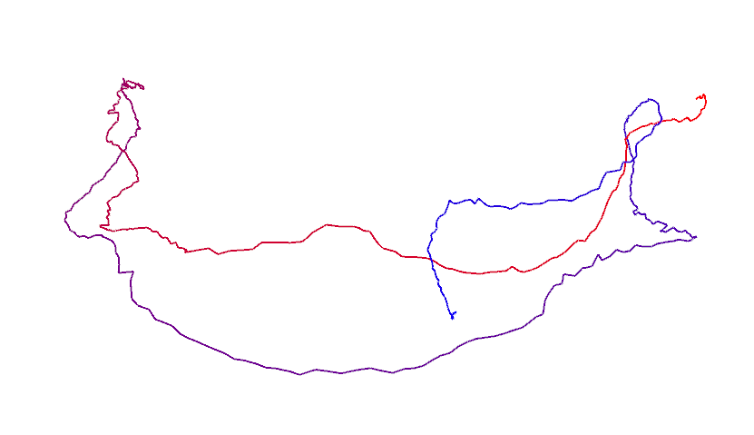
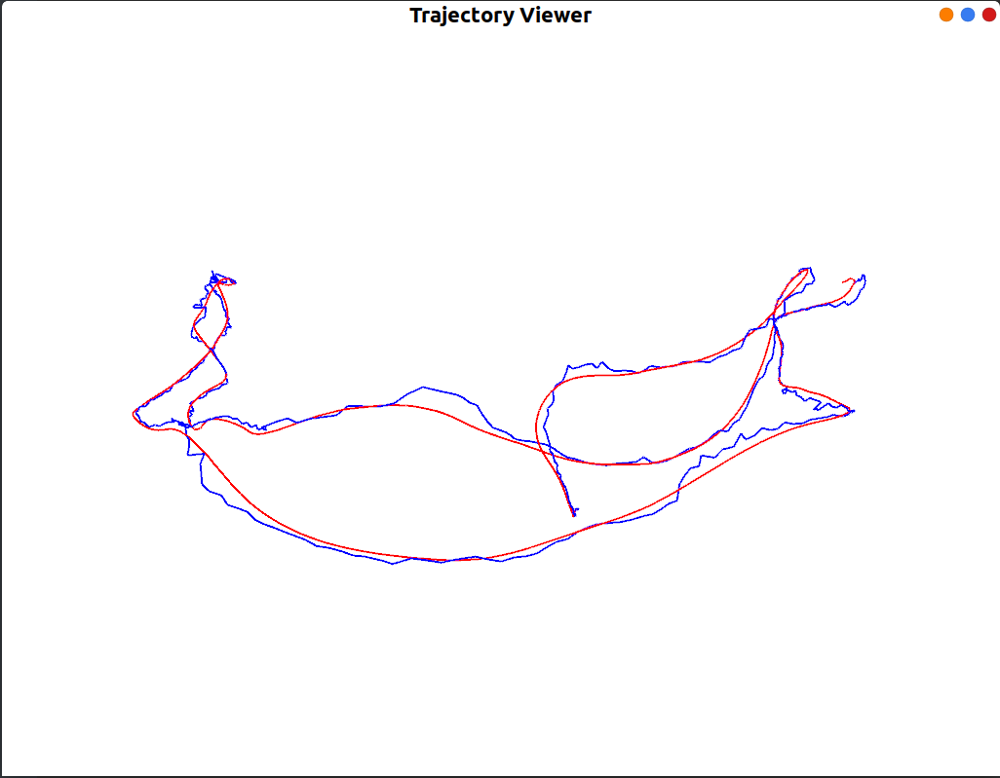

# 第三章作业

作业：曾是少年

## 二 群的性质

课上我们讲解了什么是群。请根据群定义，求解以下问题：

### 1. $\{Z, +\}$ 是否为群？若是，验证其满足群定义；若不是，说明理由。

答：{Z,+}**是群**；

对于$\{Z,+\}$，设$a_1\in Z$,$a_2 \in Z$,$a_e \in Z$。

1. 对于$\forall a_1\in Z$,$a_2 \in Z $, 有$a_1+a_2\in Z$, 因此满足**封闭性**。
2. 对于$\forall a_1\in Z,a_2\in Z,a_3\in Z$, $(a_1+a_2)+a_3 = a_1+(a_2+a_3)$，因此满足**结合律**。
3. Z中存在$0\in Z$,对于$\forall a \in Z$,有$a+0=a$,因此慢足**幺元**
4. 对于$\forall a \in Z$, 存在 $-a\in Z$,使得 $a+(-a) = 0$,因此满足**逆**。

$\{Z,+\}$满足以上四条性质，因此**是群**

###  2. $\{N, +\}$ 是否为群？若是，验证其满足群定义；若不是，说明理由。

其中$Z$为整数集，$N$为自然数集

**答：** $\{N,+\}$ **不是群；**

对于$\forall a\in N$，且$a\neq0$,$-a\notin N$,不满足逆的性质要求。因此不是群。


## 三 验证向量叉乘的李代数性质

我们说向量和叉乘运算构成了李代数，现在请你验证它。书中对李代数的定义为：李代数由⼀个集合，V，⼀个数域 F 和⼀个⼆元运算 [, ] 组成。如果它们满足以下集几条性质，称$ (V, F, [, ])$ 为⼀个李代数，记作$g$。

1. 封闭性 $∀X, Y ∈ V, [X, Y ] ∈ V$.

2. 双线性 $∀X, Y , Z ∈ V, a, b ∈ F$, 有：
   $$
   [aX + bY , Z] = a[X, Z] + b[Y , Z], [Z, aX + bY ] = a[Z, X] + b[Z, Y ].
   $$
   
3. 自反性 $∀X ∈ V, [X, X] = 0$.

4.	雅可比等价 $∀X, Y , Z ∈ V, [X, [Y , Z]] + [Y , [Z, X]] + [Z, [X, Y ]] = 0$.

其中二元运算被称为李括号。

现取集合$V=R^3$，数域$F=R$，李括号为:
$$
[a,b]=a\times b
$$
请验证$g=(R^3,R,\times)$构成李代数。

**验证**：

1. 封闭性

对于$\forall X,Y \in R^3$，$X \times Y$依然是一个向量，即$X\times Y \in R^3$,因此满足封闭性条件。

2. 双线性

对于$\forall X,Y,Z \in R^3$，$a,b\in R$，向量叉乘运算满足分配律和线性性，因此有：

$(aX+bY)\times Z = aX\times Z+bY\times Z = a(X\times Z)+b(Y\times Z)$

$Z\times(aX+bY) = aZ\times X+bZ\times Y=a(Z\times X)+b(Z\times Y)$

因此满足双线性

3. 自反性

对于 $\forall X \in R^3$,$|X\times X| = |X||X|sin0=0$，因此$X\times X = 0$,满足自反性。

4. 雅可比等价

向量的叉乘运算满足一下性质：

对于$\forall X,Y,Z \in R^3$，

* $（X×Y）×Z=(XZ)Y-(YZ)X$
* $X\times(Y\times Z) = (XZ)Y-(XY)Z$

因此
$$
X\times(Y\times Z)+Y\times(Z\times X)+Z\times(X\times Y) \\
= X(YZ)-Z(XY) + (YX)Z-(YZ)X+(ZY)X-(ZX)Y \\
= 0
$$
因此向量的叉乘运算满足雅可比恒等式。

综上所述，$g=(R^3,R,\times)$构成李代数


## 四 推导 SE(3) 的指数映射

课上给出了 SO(3) 的指数映射推导，但对于 SE(3)，仅介绍了结论，没有给出详细推导。请你完成SE(3) 指数映射部分，有关左雅可比的详细推导。

设$\xi = [\rho,\phi]^T\in se(3)$，它的指数映射为：


令$\phi = \theta a$,那么：


这也正是课件里提到的左雅可比。

**答：**令$\phi = \theta a$
$$
\begin{aligned}
\sum^{\infty}_{n=0}\frac{1}{(n+1)!}(\phi^{\wedge})^n & = \sum^{\infty}_{n=0}\frac{1}{(n+1)!}(\theta a^{\wedge})^n\\
&= I+\frac{1}{2!}(\theta a^{\wedge})+\frac{1}{3!}(\theta a^{\wedge})^2+\frac{1}{4!}(\theta a^{\wedge})^3+\frac{1}{5!}(\theta a^{\wedge})^4+...
\\
& = I+\frac{1}{2!}\theta {a^{\wedge}}+\frac{1}{3!}\theta^2 {a^{\wedge}}^2+\frac{1}{4!}{\theta}^3 {a^{\wedge}}^3+\frac{1}{5!}\theta^4 {a^{\wedge}}^4+...\\
\end{aligned}
$$

其中：
$$
\begin{equation}
(a^{\wedge})^{n} = 
\begin{cases}
\pm(a^\wedge)  & \text{n为奇数}\\
\pm(aa^T-I)  & \text{n为偶数} \\
\end{cases}
\end{equation}
$$
所以:
$$
\begin{aligned}
\sum^{\infty}_{n=0}\frac{1}{(n+1)!}(\phi^{\wedge})^n & = I+\frac{1}{2!}\theta {a^{\wedge}}+\frac{1}{3!}\theta^2 {a^{\wedge}}^2+\frac{1}{4!}{\theta}^3 {a^{\wedge}}^3+\frac{1}{5!}\theta^4 {a^{\wedge}}^4+...\\
& = I + (\frac{1}{2!}\theta-\frac{1}{4!}\theta^3+...)a^{\wedge}+(\frac{1}{3!}\theta^2-\frac{1}{5!}\theta^4+...)(aa^T-I)\\
& = I + \frac{1}{\theta}(\frac{1}{2!}\theta^2-\frac{1}{4!}\theta^4+...)a^{\wedge}+\frac{1}{\theta}(\frac{1}{3!}\theta^3-\frac{1}{5!}\theta^5+...)(aa^T-I)\\
& = I + \frac{1}{\theta}(\frac{1}{2!}\theta^2-\frac{1}{4!}\theta^4+...)a^{\wedge}+\frac{1}{\theta}(\frac{1}{3!}\theta^3-\frac{1}{5!}\theta^5+...)(aa^T-I)\\
& = \frac{1}{\theta}(\frac{1}{2!}\theta^2-\frac{1}{4!}\theta^4+...)a^{\wedge}+\frac{1}{\theta}(\frac{1}{3!}\theta^3-\frac{1}{5!}\theta^5+...)aa^T +\frac{1}{\theta}(\theta-\frac{1}{3!}\theta^3+\frac{1}{5!}\theta^5+...)I\\
& = \frac{1-cos\theta}{\theta}a^{\wedge}+\frac{1}{\theta}(\theta-sin\theta)aa^T+\frac{sin\theta}{\theta}I

\end{aligned}
$$
即：
$$
\sum^{\infty}_{n=0}\frac{1}{(n+1)!}(\phi^{\wedge})^n = \frac{1-cos\theta}{\theta}a^{\wedge}+\frac{1}{\theta}(\theta-sin\theta)aa^T+\frac{sin\theta}{\theta}I
$$


## 五 伴随

在`SO(3)` 和`SE(3)` 上，有⼀个东西称为伴随（Adjoint）。下面请你证明SO(3) 伴随的性质。
对于`SO(3)`，有：
$$
R\exp (p^{\wedge})R^T = \exp((Rp)^{\wedge})
$$
此时称`Ad(R) = R`。
提示：首先你需要证明$\forall a\in R^3,Ra^{\wedge}{R^T} = (Ra)^{\wedge}$，[页面](https://math.stackexchange.com/questions/
2190603/derivation-of-adjoint-for-so3) 提示了⼀种简洁的途径。
对于SE(3)，有：
$$
T \exp(\xi^{\wedge})T^{-1}= \exp((Ad(T)\xi^{\wedge})
$$
其中`Ad(T)`定义为：
$$
Ad(T) = 
\left[\begin{array}{ccc}
R & t^{\wedge}R
\\ 0&R
\end{array}\right]
$$
这个性质将在后文的Pose Graph 优化中用到。但是SE(3) 的证明较为复杂，不作要求。
完整的SO(3) 和SE(3) 性质见1和2。

**证明**：

我们先来证明$Ra^{\wedge}R^T=(Ra)^{\wedge}$，过程如下：·
$$
a^{\wedge}v = a\times v
$$
我们可以通过使等式的RHS作用于任意向量v来证明该等式：
$$
\begin{aligned}
(Ra)^{\wedge}v &= (Ra)\times v
\\&=(Ra)\times (RR^{-1}v) &(RR^{-1}=I)
\\&=R[a \times(R^{-1}v)]  &(分配律)
\\&=Ra^{\wedge}R^{-1}v    &(结合律)
\end{aligned}
$$
因此得到：
$$
(Ra)^{\wedge}=Ra^{\wedge}R^{-1}
$$
而R是正交矩阵，因此
$$
(Ra)^{\wedge}=Ra^{\wedge}R^{T}
$$
令$\rho=\theta a$
$$
\begin{aligned}
R\exp(\theta a^{\wedge})R^T & = R(\cos\theta I+(1-\cos\theta)aa^T+\sin\theta a^{\wedge})R^T\\ 
& = \cos\theta I+(1-cos\theta)Ra(Ra)^T+sin\theta Ra^{\wedge}R^T\\
&=\cos\theta I+(1-cos\theta)Ra(Ra)^T+sin\theta (Ra)^{\wedge}\\
&= \exp(\theta (Ra)^{\wedge})\\
&= \exp((R\rho)^{\wedge})
\end{aligned}
$$
证毕。

---

拓展：**伴随表示**

在[数学](https://wiki.hk.xileso.top/baike-數學)中，一个[李群](https://wiki.hk.xileso.top/baike-李群) *G* 的**伴随表示**（adjoint representation）或**伴随作用**（adjoint action）是 *G* 在它自身的[李代数](https://wiki.hk.xileso.top/baike-李代數)上的自然表示。这个表示是群 *G* 在自身上的[共轭](https://wiki.hk.xileso.top/baike-共轭_(群论))[作用](https://wiki.hk.xileso.top/baike-群作用)的线性化形式。


## 六 轨迹的描绘

我们通常会记录机器人的运动轨迹，来观察它的运动是否符合预期。大部分数据集都会提供标准轨迹以供参考，如 `kitti`、`TUM-RGBD` 等。这些文件会有各自的格式，但首先你要理解它的内容。记世界坐标系为 `W`，机器⼈坐标系为 `C`，那么机器人的运动可以用 $T_{WC}$ 或 $T_{CW}$ 来描述。现在，我们希望画出机器⼈在世界当中的运动轨迹，请回答以下问题：

1. 事实上，$T_{WC}$ 的平移部分即构成了机器人的轨迹。它的物理意义是什么？为何画出 $T_{WC}$ 的平移部分就得到了机器⼈的轨迹？

   **答**:**物理意义**: $T_{WC}$指的是从世界坐标系原点到相机中心的平移向量; 

   世界坐标系不随相机运动变化,因此可以认为$T_{wc}$是机器人相对于原点坐标在移动, 移动可视化在观察者眼中就是是机器人的运动轨迹

2. 我为你准备了⼀个轨迹文件（code/trajectory.txt）。该文件的每⼀行由若干个数据组成，格式为
   $$
   [t, t_x, t_y, t_z, q_x, q_y, q_z, q_w]
   $$
   其中 t 为时间，$tx, ty, tz$ 为 $T_{WC}$ 的平移部分，$q_x, q_y, q_z, q_w$ 是四元数表示的 $T_{WC}$ 的旋转部分，$q_w$为四元数实部。同时，我为你提供了画图程序 `draw_trajectory.cpp` 文件。该⽂件提供了画图部分的代码，请你完成数据读取部分的代码，然后书写 `CMakeLists.txt` 以让此程序运行起来。注意我们需要用到 `Pangolin` 库来画图，所以你需要事先安装 `Pangolin`（如果你做了第⼀次作业，那么现在已经安装了）。`CMakeLists.txt` 可以参照 `ORB-SLAM2` 部分。

   **答**:实现过程:使用fstream读取文件中的数据,在编译的时候遇到一点小bug,不过都解决了.

   读取数据的代码块如下:

   ```c++
       double t,t_x,t_y,t_z,q_x,q_y,q_z,q_w;
       while(!inFILE.eof())
       {
           inFILE>>t;
           inFILE>>t_x;
           inFILE>>t_y;
           inFILE>>t_z;
           inFILE>>q_x;
           inFILE>>q_y;
           inFILE>>q_z;
           inFILE>>q_w;
           poses.push_back(Sophus::SE3(Eigen::Quaterniond(q_w,q_x,q_y,q_z),Eigen::Vector3d(t_x,t_y,t_z)));
       }
   ```

   运行结果如下所示;



该图中:轨迹首尾颜色不一样,通过观察,发现是着色函数设置的颜色随位置变化.


## 附加题 七 轨迹的误差

除了画出真实轨迹以外，我们经常需要把 SLAM 估计的轨迹与真实轨迹相比较。下面说明比较的原理，请你完成比较部分的代码实现。

设真实轨迹（ground-truth）为 $T_g$，估计轨迹 $T_e$。它们都以 $T_{WC}$ 的形式存储，格式同上题。现在，你需要计算估计轨迹的误差。我们假设每⼀个 $T_g$ 都与给定的 $T_e$ 对应。那么，对于任意第 i 个位姿，它的误差可定义为：
$$
e_i=||\log(T^{-1}_{gi}T_{ei})^{\vee}||_2.
$$
即两个位姿之差的李代数二范数。于是，可以定义两条轨迹的均方根（Root-Mean-Square-Error, RMSE）误差为：
$$
RMSE(g,e)=\sqrt{\frac{1}{n}\sum^{n}_{i=1}e_i^2}
$$
我为你准备了 `code/ground-truth.txt` 和 `code/estimate.txt` 两条轨迹。请你根据上⾯公式，实现 RMSE的计算代码，给出最后的 RMSE 结果。作为验算，参考答案为：2.207。

注:

1.	实际当中的轨迹比较还要更复杂⼀些。通常 `ground-truth` 由其他传感器记录（如 vicon），它的采样频率通常高于相机的频率，所以在处理之前还需要按照时间戳对齐。另外，由于传感器坐标系不一致致，还需要计算两个坐标系之间的差异。这件事也可以⽤ ICP 解得，我们将在后面的课程中讲到。

1.	你可以用上题的画图程序将两条轨迹画在同⼀个图里，看看它们相差多少。

**答**：添加的代码主要包括三部分:

1. 读取两个文件`ground-truth.txt`和`estimate.txt`，该部分与上一题中的相同。

2. 计算rmse，对于已经得到的两个pose集合，可以通过以下代码计算。

   ```C++
   double calculateRMSE(vector<Sophus::SE3, Eigen::aligned_allocator<Sophus::SE3>> truth_poses,vector<Sophus::SE3, Eigen::aligned_allocator<Sophus::SE3>> estimated_poses)
   {
       double rmse=0.0;
       for(int i = 0;i<truth_poses.size();i++)
       {
           Eigen::Matrix<double ,6,1> se3;
           se3 = (truth_poses[i].inverse()*estimated_poses[i]).log(); //这里是通过一个把其中一个变换乘以一个逆变换得到一个差矩阵，再通过.log()可以转换为向量形式
           rmse+=se3.squaredNorm();
       }
       rmse = sqrt(rmse/(double)truth_poses.size());
       return rmse;
   }
   ```

3. 画图，修改轨迹绘制代码，函数部分代码如下所示：

   ```C++
   while (pangolin::ShouldQuit() == false) {
       glClear(GL_COLOR_BUFFER_BIT | GL_DEPTH_BUFFER_BIT);
   
       d_cam.Activate(s_cam);
       glClearColor(1.0f, 1.0f, 1.0f, 1.0f);
   
       glLineWidth(2);
       for (size_t i = 0; i < truth_poses.size() - 1; i++) {
           glColor3f(1.0f, 0.0f, 0.0f);
           glBegin(GL_LINES);
           auto p1 = truth_poses[i], p2 = truth_poses[i + 1];
           glVertex3d(p1.translation()[0], p1.translation()[1], p1.translation()[2]);
           glVertex3d(p2.translation()[0], p2.translation()[1], p2.translation()[2]);
           glEnd();
   
           glColor3f(0.0f, 0.0f, 1.0f);
           glBegin(GL_LINES);
           p1 = estimated_poses[i], p2 = estimated_poses[i + 1];
           glVertex3d(p1.translation()[0], p1.translation()[1], p1.translation()[2]);
           glVertex3d(p2.translation()[0], p2.translation()[1], p2.translation()[2]);
           glEnd();
   
       }
       pangolin::FinishFrame();
       usleep(5000);   // sleep 5 ms
   }
   ```

   最后运行结果如下：

   ```C++
   /home/guoben/Project/SLAM-homework/ch3/draw_trajectory/bin/drawtraj
   rmse:2.20727
   ```

   

   其中，红色轨迹表示真值，蓝色轨迹表示估计值

