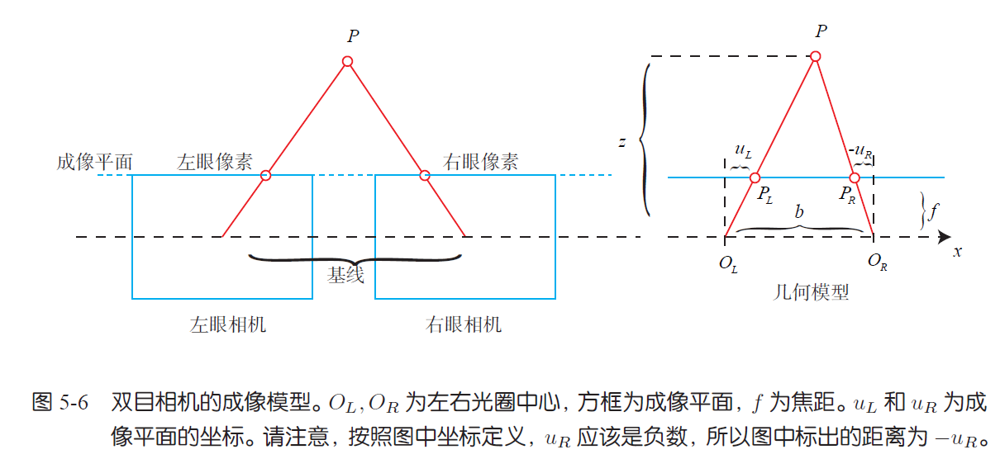
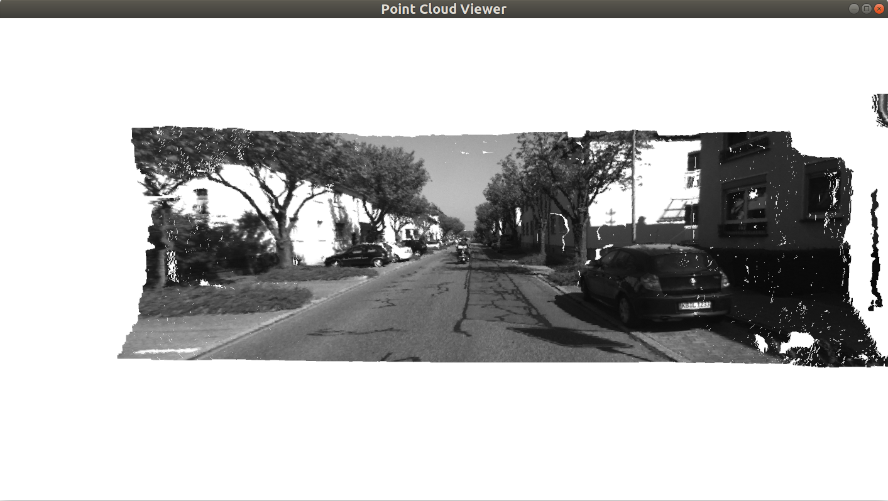
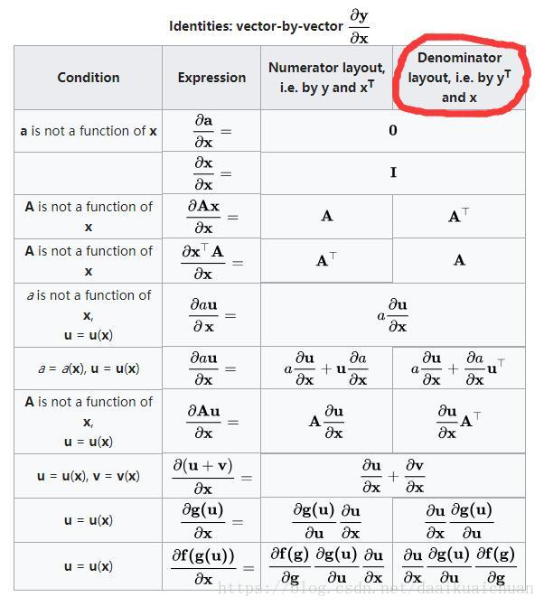
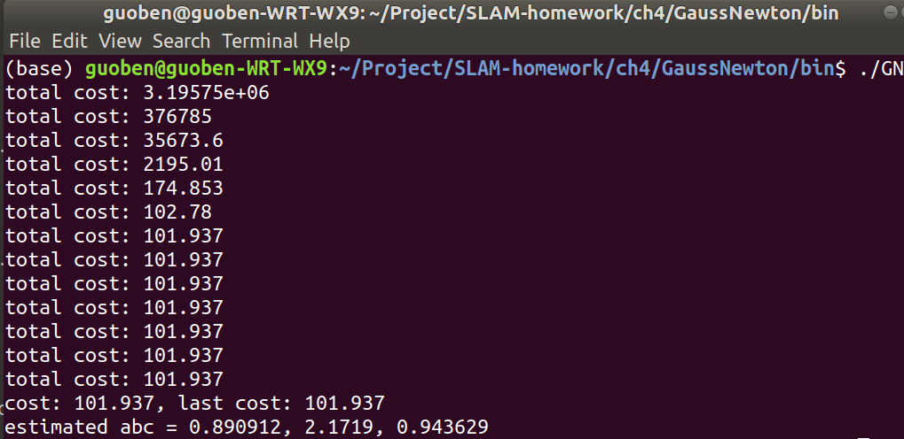

# 第四章作业

作者：曾是少年

## 二 图像去畸变

现实生活中的图像总存在畸变。原则上来说，针孔透视相机应该将三维世界中的直线投影成直线，但是当我们使用广角和鱼眼镜头时，由于畸变的原因，直线在图像里看起来是扭曲的。本次作业，你将尝试如何对一张图像去畸变，得到畸变前的图像。

图1 是本次习题的测试图像（`code/test.png`），来自EuRoC 数据集[1]。可以明显看到实际的柱子、箱子的直线边缘在图像中被扭曲成了曲线。这就是由相机畸变造成的。根据我们在课上的介绍，畸变前后的坐标变换为：
$$
x_{distorted} = x(1 + k_1r^2 + k_2r^4)+ 2p_1xy + p_2(r^2 + 2x^2)\\
y_{distorted} = y(1 + k_1r^2 + k_2r^4)+ p_1(r^2 + 2y^2)+ 2p_2xy
$$
其中x; y 为去畸变后的坐标，$x_{distorted}$，$ y_{distroted}$ 为去畸变前的坐标。

现给定参数：
$$
k_1= 0.28340811; k2 = 0.07395907; p_1 = 0.00019359; p_2 = 1.76187114e^{-5}:
$$
以及相机内参
$$
f_x = 458.654; f_y = 457.296; c_x = 367.215; c_y = 248.375:
$$
请根据`undistort_image.cpp` 文件中内容，完成对该图像的去畸变操作。


**答：** **去畸变过程**主要包括以下步骤：

1. 将图像的像素坐标系通过内参矩阵转换到相机归一化坐标系
   $$
   x = (u-c_x)/f_x\\
   y = (v-c_y)/f_y
   $$

2. 在相机坐标系下进行去畸变操作
   $$
   r = \sqrt{x^2+y^2}\\
   x' = x*(1+k_1*r^2+k_2*r^4)+2*p_1*x*y+p_2*(r^2+2*x^2)\\
   y' = y*(1+k_1*r^2+k_2*r^4)+2*p_2*x*y+p_1*(r^2+2*y^2)\\
   $$

3. 去畸变操作结束后，将相机坐标系重新转换到图像像素坐标系
   $$
   u'=x'*f_x+c_x\\
   v'=y'*f_y+c_y
   $$

4. 用源图像的像素值对新图像的像素点进行插值

### 代码修改部分

```C++
// u(x) 列 v(y) 行
double u_distorted = 0, v_distorted = 0;            
// TODO 按照公式，计算点(u,v)对应到畸变图像中的坐标
// start your code here

// 把像素坐标系的点投影到归一化平面
double x = (u-cx)/fx, y = (v-cy)/fy; 

// 计算图像点坐标到光心的距离；
double r = sqrt(x*x+y*y);

// 计算投影点畸变后的点
double x_distorted = x*(1+k1*r+k2*r*r)+2*p1*x*y+p2*(r+2*x*x); 
double y_distorted = y*(1+k1*r+k2*r*r)+2*p2*x*y+p1*(r+2*y*y); 

// 把畸变后的点投影回去
u_distorted = x_distorted*fx+cx;
v_distorted = y_distorted*fy+cy;
// end your code here
```

#### 运行结果截图


## 三 双目视差的使用

​		双目相机的一大好处是可以通过左右目的视差来恢复深度。课程中我们介绍了由视差计算深度的过程。本题，你需要根据视差计算深度，进而生成点云数据。本题的数据来自`Kitti` 数据集[2]。
​	`Kitti` 中的相机部分使用了一个双目模型。双目采集到左图和右图，然后我们可以通过左右视图恢复出深度。经典双目恢复深度的算法有`BM(Block Matching)`, `SGBM(Semi-Global Block Matching)`[3, 4] 等，
但本题不探讨立体视觉内容（那是一个大问题）。我们假设双目计算的视差已经给定，请你根据双目模型，画出图像对应的点云，并显示到`Pangolin` 中。
​	本题给定的左右图见`code/left.png` 和`code/right.png`，视差图亦给定，见code/right.png。双目的参数如下：
$$
f_x = 718.856; f_y = 718.856; c_x = 607.1928; c_y = 185.2157:
$$
且双目左右间距（即基线）为：
$$
d = 0.573 m:
$$
请根据以上参数，计算相机数据对应的点云，并显示到Pangolin 中。程序请参考`code/disparity.cpp` 文件。


**答**：课本中的**双目相机模型如**下：



**深度计算公式**为：
$$
depth = \frac{f*b}{d}
$$
在程序中，视差disp由深度图提供(uchar类型)。，f焦距由$f_x$给出，b是基线距离（程序中由d表示，可能会有一点混淆）。

课本中提到。虽然由视差计算深度的公式很简洁，但视差d 本身的计算却比较困难。本程序中**已经提供了视差图**因此很容易计算得到深度。

注意事项：

* 计算点的时候需要把像素点先转换到相机坐标系。
* 程序中基线距离的表示符号为d
* 视差图中数据类型为uchar

**点云计算代码**

```C++
// TODO 根据双目模型计算点云
// 如果你的机器慢，请把后面的v++和u++改成v+=2, u+=2
for (int v = 0; v < left.rows; v++)
    for (int u = 0; u < left.cols; u++) {

        Vector4d point(0, 0, 0, left.at<uchar>(v, u) / 255.0); // 前三维为xyz,第四维为颜色
        // start your code here (~6 lines)
        // 根据双目模型计算 point 的位置
        double x = (u-cx)/fx;
        double y = (v-cy)/fy;
        float disp = disparity.at<uchar>(v,u); //视差
        double depth = fx*d/(disp);//  d是基线
        point[0] = x*depth;
        point[1] = y*depth;
        point[2] = 1*depth;
        pointcloud.push_back(point);
        // end your code here
    }
```

生成的点云截图如下所示：




## 四 矩阵运算微分

​		在优化中经常会遇到矩阵微分的问题。例如，当自变量为向量x，求标量函数u(x) 对x 的导数时，即为矩阵微分。通常线性代数教材不会深入探讨此事，这往往是矩阵论的内容。我在`ppt/`目录下为你准备了一份清华研究生课的矩阵论课件（仅矩阵微分部分）。阅读此ppt，回答下列问题：
设变量为$x \in R^N$，那么：

### 1. 矩阵$A \in R^{N\times N}$，那么d(Ax)/dx 是什么？

答：$x$是$n\times1$列向量 

令矩阵$A = [a_1,a_2,...,a_n]$ , $A = [a_1';a_2';...;a_n']$
$$
\begin{aligned}
\frac{\partial{{Ax}}}{\partial x} &= 
\left[
\begin{array}{ccc}
\frac{\partial{{Ax}_1}}{\partial x_1}&
\frac{\partial{Ax}_2}{\partial x_1}&
...&
\frac{\partial{Ax}_n}{\partial x_1}\\

\frac{\partial{{Ax}_1}}{\partial x_2}&
\frac{\partial{Ax}_2}{\partial x_2}&
...&
\frac{\partial{Ax}_n}{\partial x_2}\\
... & ... &...&...\\
\frac{\partial{{Ax}_1}}{\partial x_n}&
\frac{\partial{Ax}_2}{\partial x_n}&
...&
\frac{\partial{Ax}_n}{\partial x_n}\\

\end{array}
\right]
\end{aligned}
$$
先对x的第i个分量求导：
$$
\begin{aligned}
\frac{\partial{Ax}_i}{\partial x_k} &= 
\frac{\partial{a_ix}}{\partial x_k} =a_{ik}
\end{aligned}
$$
导入前式有：
$$
\begin{aligned}
\frac{\partial{{Ax}}}{\partial x} &= 
\left[
\begin{array}{ccc}
a_{11} & a_{21} & ...& a_{n1}\\
a_{12} & a_{22} & ... & a_{n2}\\
... & ... &...&...\\
a_{1n} & a_{2n} & ...& a_{nn}\\
\end{array}
\right]
\end{aligned}
 = A^T
$$


### 2. 矩阵$A \in R^{N\times N}$，那么$d(x^TAx)/dx$ 是什么？

**答**：
$$
\begin{aligned}
\frac{\partial{x^TAx}}{\partial x} &= 
\left[
\begin{array}{ccc}
\frac{\partial{x^TAx}}{\partial x_1}&
\frac{\partial{x^TAx}}{\partial x_2}&
...&
\frac{\partial{x^TAx}}{\partial x_n}

\end{array}
\right]
\end{aligned}
$$
先对x的第k个分量求导，结果如下：
$$
\begin{aligned}
\frac{\partial{x^TAx}}{\partial x_k} &= 
\frac{\partial{\sum^n_{i=1}\sum_{j=1}^nx_{i}A_{ij}x_j}}{\partial x_k}\\
&=\sum^n_{i=1} A_{ik}x_i+\sum^n_{j=1}A_{kj}x_j\\
&=a^T_kx+a'_kx
\end{aligned}
$$
可以看出第一部分是矩阵A的第k列转置后和x相乘得到，第二部分是矩阵A的第k行和x相乘得到，排列好就是:
$$
\frac{\partial{x^TAx}}{\partial x} =  A^Tx+Ax
$$


### 3. 证明：$x^TAx = tr(Axx^T)$

**证明**：

设a,b都是n维列向量，显然有
$$
ab^T=
\left[
\begin{array}{ccc}
a_1b_1&a_1b_2&...&a_1b_n\\
a_2b_1&a_2b_2&...&a_2b_n\\
...&...&...&...\\
a_nb_1&a_nb_2&...&a_nb_n
\end{array}
\right]
$$

$$
b^Ta=\sum^{n}_{i=1}a_ib_i
$$

显然，可以得到：
$$
tr(ab^T)=b^Ta
$$
令 $a=Ax$ , $b=x$ 可得
$$
tr(Axx^T)=tr((Ax)x^T)=x^TAx
$$
**证毕**


附加参考：




## 五 高斯牛顿法的曲线拟合实验

我们在课上演示了用`Ceres` 和`g2o` 进行曲线拟合的实验，可以看到优化框架给我们带来了诸多便利。
本题中你需要自己实现一遍高斯牛顿的迭代过程，求解曲线的参数。我们将原题复述如下。设有曲线满足以下方程：
$$
y = \exp(ax^2 + bx + c) + w.
$$
其中$a, b, c$ 为曲线参数，`w `为噪声。现有N个数据点$(x,y)$，希望通过此N个点来拟合$a, b, c$。实验中取$N = 100$。
那么，定义误差为$e_i = y_i - \exp(ax^2_i+bx_i + c)$，于是$(a, b,c)$ 的最优解可通过解以下最小二乘获得：
$$
\min_{a,b,c}\frac{1}{2}\sum^{N}_{i=1}||y_i\exp(ax_i^2+bx_i+c)||^2
$$
现在请你书写`Gauss-Newton` 的程序以解决此问题。程序框架见`code/gaussnewton.cpp`，请填写程序内容以完成作业。作为验证，按照此程序的设定，估计得到的a; b; c 应为：$a = 0.890912; b = 2.1719; c = 0.943629,$
这和书中的结果是吻合的。

**答**：先回顾高斯牛顿法求解最小二乘问题的步骤：
$$
\Delta x^{*} = \arg \min_{\Delta x}\frac{1}{2}||f(x)+J(x)^T\Delta x||^2
$$

1.  给定初始值$x_0$。
2.  对于第k 次迭代，求出当前的雅可比矩阵$J(x_k)$ 和误差$f(x_k)$。
3.  求解增量方程：$HΔx_k = g$。
4.  若$Δx_k$ 足够小，则停止。否则，令$x_{k+1} = x_k + Δx_k$，返回第2 步。

**可以按照以上步骤来修改代码**

**1.** 设置初始值

```C++
double ae = 2.0, be = -1.0, ce = 5.0;
```

**2.** 计算雅可比矩阵$J(x_k)$ 和误差$f(x_k)$。

计算误差 $error = f(x_i)-f_e(x_i)$

```C++
error = yi - exp(ae * xi * xi + be * xi + ce);
```

计算雅可比矩阵$J = \frac{\partial error} {\partial x} $

```C++
Vector3d J; // 雅可比矩阵
J[0] = - exp(ae * xi * xi + be * xi + ce)* xi * xi;  // de/da
J[1] = - exp(ae * xi * xi + be * xi + ce)* xi;  // de/db
J[2] = - exp(ae * xi * xi + be * xi + ce);  // de/dc
```

**3.**  求解增量方程

计算增量矩阵H

```C++
H += J * J.transpose(); // GN近似的H
```

计算g

```C++
b += -error * J;
```

用EIgen中的ldlt求解$H\Delta x =b$。

```C++
Vector3d dx;
dx = H.ldlt().solve(b);
```

**4.** 若$Δx_k$ 足够小，则停止。否则，令$x_{k+1} = x_k + Δx_k$，返回第2 步。

```C++
if (iter > 0 && cost > lastCost) {
    // 误差增长了，说明近似的不够好
    cout << "cost: " << cost << ", last cost: " << lastCost << endl;
    break;
}
```

至此，代码修改完毕。

**运行结果**：

```cmd
/home/guoben/Project/SLAM-homework/ch4/GaussNewton/bin/GN
total cost: 3.19575e+06
total cost: 376785
total cost: 35673.6
total cost: 2195.01
total cost: 174.853
total cost: 102.78
total cost: 101.937
total cost: 101.937
total cost: 101.937
total cost: 101.937
total cost: 101.937
total cost: 101.937
total cost: 101.937
cost: 101.937, last cost: 101.937
estimated abc = 0.890912, 2.1719, 0.943629

Process finished with exit code 0
```

**截图**




## 附加题 * 批量最大似然估计

考虑离散时间系统：
$$
x_k = x_{k-1} + v_k + w_k; w\sim N (0;Q)\\
y_k = x_k + n_k;  n_k \sim N (0;R)
$$
这可以表达一辆沿x 轴前进或后退的汽车。第一个公式为运动方程，$v_k$ 为输入，$w_k$ 为噪声；第二个公式为观测方程，$y_k$ 为路标点。取时间$k = 1,...,3$，现希望根据已有的$v,y$ 进行状态估计。设初始状态$x_0$ 已知。
请根据本题题设，推导批量（batch）最大似然估计。首先，令批量状态变量为

$x = [x_0, x_1, x_2, x_3]^T$，令批量观测为$z = [v_1, v_2, v_3, y_1, y_2, y_3]^T$，那么：

### 1. 可以定义矩阵 H，使得批量误差为$e = z - Hx$。请给出此处H的具体形式。

**答**：该线性系统很简单，很容易的写成以下形式
$$
v_k = x_k-x_{k-1}  + w_k\\
y_k= x_k + n_k\\
$$
而$z-Hx=e\sim N(0,\Sigma)$, 向量化上式可以得到：
$$
H=
\left[
\begin{array}{ccc}
-1& 1& 0& 0\\
0 &-1& 1& 0\\
0 & 0&-1& 1\\
0&1&0&0\\
0&0&1&0\\
0&0&0&1\\
\end{array}
\right]
$$


### 2. 据上问，最大似然估计可转换为最小二乘问题, 请给出此问题下信息矩阵W 的具体取值。

$$
x^{*} = \arg \min \frac{1}{2}(z - Hx)^TW^{-1}(z-Hx)
$$

其中W 为此问题的信息矩阵，可以从最大似然的概率定义给出。

**答**：$W=diag(Q,R)$
$$
\begin{aligned}
x^{*} &= \arg \max P(x|z) = \arg \max P(z|x)\\
&=\prod^{3}_{k=1}P(v_k|x_{k-1},x_k)\prod^{3}_{k=1}P(y_k|x_k)

\end{aligned}
$$
其中 $P(v_k|x_{k-1},x_k)=N(x_k-x_{k-1},Q) $，

$P(y_k|x_k) = N(x_k,R)$。

误差变量如下：
$$
e_{v,k}=x_k-x_{k-1}-v_k, e_{z,k}=y_k-x_k
$$
对概率取对数，可以把最小二乘的目标函数化为如下形式：
$$
\min\sum^3_{k=1} e^{T}_{v,k}Q^{-1}e_{v,k}+\sum^3_{k=1}e^T_{y,k}R^{-1}e_{y,k}
$$
因此$W=diag(Q,Q,Q,R,R,R)$; 即
$$
W = 
\left[
\begin{array}{ccc}
Q & 0 & 0 & 0 & 0 & 0\\
0 & Q & 0 & 0 & 0 & 0\\
0 & 0 & Q & 0 & 0 & 0\\
0 & 0 & 0 & R & 0 & 0\\
0 & 0 & 0 & 0 & R & 0\\
0 & 0 & 0 & 0 & 0 & R\\
\end{array}
\right]
$$
此时，最小二乘问题可以写为：
$$
x^{*} =\arg \min e^T W^{-1} e
$$


### 3. 假设所有噪声相互无关，该问题存在唯一的解吗？若有，唯一解是什么？若没有，说明理由。

**答**:	当噪声相互无关的时候，该问题存在唯一解。

因为$Hx=z$ 这个式子中H是6*4矩阵，**方程个数大于未知量个数的方程组**，是一个超定矩阵。而系数矩阵超定时，最小二乘问题可以得到唯一解。

**唯一最小二乘解**如下：
$$
x=(H^TH)^{-1}H^Tz
$$
