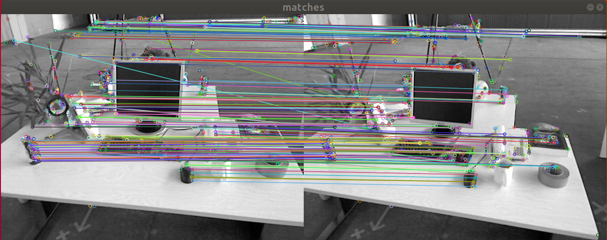
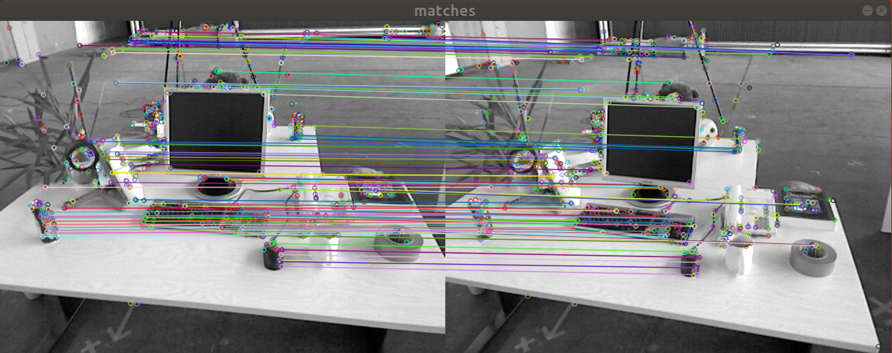
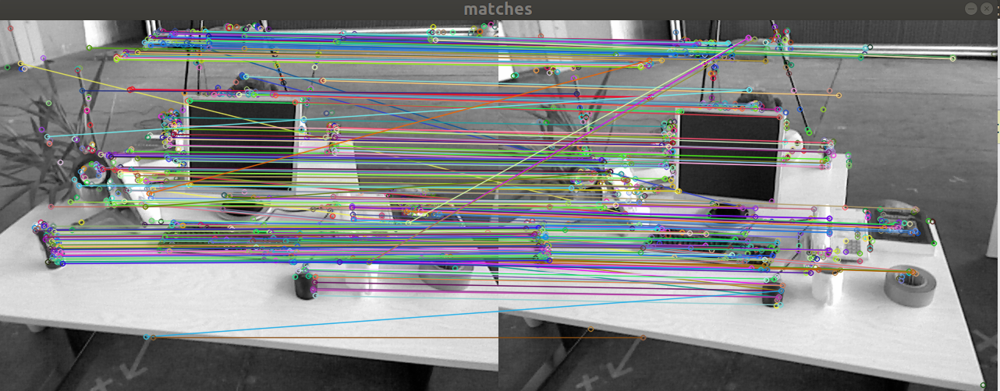

<<<<<<< HEAD
# 第五章作业
=======
# 第五章作业

作者：曾是少年

## 二 ORB特征点

`ORB(Oriented FAST and BRIEF)` 特征是 SLAM 中一种很常用的特征，由于其二进制特性，使得它可以非常快速地提取与计算 [1]。下面，你将按照本题的指导，自行书写 ORB 的**提取**、**描述子的计算**以及**匹配**的代码。

代码框架参照 `computeORB.cpp` 文件，图像见 `1.png` 文件和 `2.png`。

### 2.1 ORB提取

ORB 即 `Oriented FAST` 简称。它实际上是 `FAST` 特征再加上一个旋转量。本习题将使用 `OpenCV` 自带的 FAST 提取算法，但是你要完成旋转部分的计算。旋转的计算过程描述如下 [2]：在一个小图像块中，先计算质心。质心是指以图像块灰度值作为权重的中心。

1. 在一个小的图像块 B 中，定义图像块的矩为：
$$
m_{pq} = \Sigma_{x,y\in B}x^py^qI(x, y), p, q = \{0, 1\}.
$$
2. 通过矩可以找到图像块的质心：
$$
  C = (\frac{m_{10}}{m_{00}},\frac{m_{01}}{m_{00}})
$$
3.  连接图像块的几何中心 O 与质心 C，得到一个方向向量$\rightarrow_{OC}$，于是特征点的方向可以定义为：
$$
  θ = \arctan(m_{01}/m_{10}).
$$
  实际上只需计算 $m_{01}$ 和 $m_{10}$ 即可。习题中取图像块大小为 `16x16`，即对于任意点 $(u, v)$，图像块从$  (u − 8, v − 8)$ 取到 $(u + 7, v + 7) $即可。请在习题的 `computeAngle `中，为所有特征点计算这个旋转角。
 提示：

  1. 由于要取图像 16x16 块，所以位于边缘处的点（比如 u < 8 的）对应的图像块可能会出界，此时需要判断该点是否在边缘处，并跳过这些点。
  2. 由于矩的定义方式，在画图特征点之后，角度看起来总是指向图像中更亮的地方。
  3. `std::atan` 和 `std::atan2` 会返回弧度制的旋转角，但 `OpenCV` 中使用角度制，如使用 `std::atan` 类函数，请转换一下。

  作为验证，第一个图像的特征点如图 1 所示。看不清可以放大看。


  图 1: 带有旋转的 FAST

**答**：计算角度过程在题目中已经讲的很清楚了，代码如下：

```C++
void computeAngle(const cv::Mat &image, vector<cv::KeyPoint> &keypoints) {
    int half_patch_size = 8;
    for (auto &kp : keypoints) {
	// START YOUR CODE HERE (~7 lines)
        kp.angle = 0; // compute kp.angle
        float u = kp.pt.x , v = kp.pt.y;
        float m01=0 , m10=0; //矩的计算
        if((u-8>=0) && (u+7)<=image.cols &&(v-8>=0)&& (u+7)<=image.rows){
            for (int i = -8; i <= 7; ++i) {
                for (int j = -8; j <= 7; ++j) {
                    m01 += (v + j) * image.at<uchar>(v + j, u + i) ;
                    m10 += (u + i) * image.at<uchar>(v + j, u + i) ;
                }
            }
            kp.angle = atan2(m01 , m10) / pi *180; //角度的计算
        }
        // END YOUR CODE HERE
    }
    return;
}
```

其中，需要注意的点如下(从网络得到)：

1. 关于`KeyPoint`，其内含一个`Point2f`对象存储`xy`值，用`.pt`获取，含有一个angle值也可直接获取。另外还有size，response，octave，class_id等其他特征点或者分类任务会用到的域。
2. math.h库中：
   * `atan` 给斜率求正切，仅对`-90°，-90°`有效
   * `atan2`给两点值，值域为整个圆 `-180°——180°`，(本题中应该使用`atan2`)
   * 另外注意角度弧度转换，`angle`存储度数，`atan`使用弧度
3. 质心`m10`和`m01`:
   * 累加时乘在前面的值可以是绝对坐标`p.x+j`或`p.y+i`，也可以用j和i的相对坐标。
   * 使用相对坐标的质心有优势：在求`cx`和`cy`时，如果是绝对坐标，那么`m00`每一步也必须乘上`p.x`和`p.y`，并且算出来是绝对质心计算角度还需要做一次差，相对坐标可以避免多步乘法和减法运算。

### 2.2 ORB 描述

<<<<<<< HEAD
### 2.3 暴力匹配
>>>>>>> b7402b8e64d354a5886166fc57c6961c210fe69c
=======
​	ORB 描述即带旋转的 BRIEF 描述。所谓 BRIEF 描述是指一个 0-1 组成的字符串（可以取 256 位或128 位），每一个 bit 表示一次像素间的比较。算法流程如下：

1. 给定图像 I 和关键点 (u, v)，以及该点的转角 θ。以 256 位描述为例，那么最终描述子
   $$
   d = [d_1, d_2, ..., d_{256}].
   $$

2. 对任意 $i = 1, . . . , 256$，$d_i$ 的计算如下。取 (u, v) 附近任意两个点 p, q，并按照 θ 进行旋转：
   $$
   \left[
   \begin{array}{ccc}
   u'_p\\
   v_p'
   \end{array}
   \right]
   =
   \left[
   \begin{array}{ccc}
   cos \theta & -sin\theta\\
   sin \theta & cos\theta
   \end{array}
   \right]
   \left[
   \begin{array}{ccc}
   u_p\\
   v_p
   \end{array}
   \right]
   $$
   其中 $u_p$,$ v_p$ 为 p 的坐标，对 q 亦然。记旋转后的 p, q 为 p′, q′，那么比较 $I(p′) $和 $I(q′)$，若前者大，记 $d_i = 0$，反之记 $d_i = 1$。

这样我们就得到了 ORB 的描述。我们在程序中用 256 个 `bool` 变量表达这个描述2。请你完成 `computeORBDesc` 函数，实现此处计算。注意，通常我们会固定 p, q 的取法（称为 ORB 的 pattern），否则每次都重新随机选取，会使得描述不稳定。我们在全局变量 `ORB_pattern` 中定义了 p, q 的取法，格式为$u_p, v_p, u_q, v_q$。请你根据给定的 pattern 完成 `ORB` 描述的计算。

**提示**

1. p, q 同样要做边界检查，否则会跑出图像外。如果跑出图像外，就设这个描述子为空。
2. 调用 `cos` 和 `sin` 时同样请注意弧度和角度的转换。

**答：**

```C++
void computeORBDesc(const cv::Mat &image, vector<cv::KeyPoint> &keypoints, vector<DescType> &desc) {
    for (auto &kp: keypoints) {
        DescType d(256, false);
        for (int i = 0; i < 256; i++) {
            // START YOUR CODE HERE (~7 lines)
            d[i] = 0;  // if kp goes outside, set d.clear()
            float theta = kp.angle /180 *pi;
            int u = kp.pt.x, v = kp.pt.y;
            int u_p = ORB_pattern[4*i], v_p = ORB_pattern[4*i+1], u_q = ORB_pattern[4*i+2],v_q = ORB_pattern[4*i+3];
            float u_p1 = cos(theta) * u_p - sin(theta) * v_p + u;
            float v_p1 = sin(theta) * u_p + cos(theta) * v_p + v;
            float u_q1 = cos(theta) * u_q - sin(theta) * v_q + u;
            float v_q1 = sin(theta) * u_q + cos(theta) * v_q + v;
            if (u_p1 >= 0 && u_p1 <= image.cols && v_p1 >= 0 && v_p1 <= image.rows &&
                u_q1 >= 0 && u_q1 <= image.cols && v_q1 >= 0 && v_q1 <= image.rows) {
                    if (image.at<uchar>(v_p1, u_p1) < image.at<uchar>(v_q1, u_q1))
                        d[i] = true;
            } else
            {
                d.clear();
                break;
            }
	    // END YOUR CODE HERE
        }
        desc.push_back(d);
    }

    int bad = 0;
    for (auto &d: desc) {
        if (d.empty()) bad++;
    }
    cout << "bad/total: " << bad << "/" << desc.size() << endl;
    return;
}
```


### 2.3 暴力匹配

​	在提取描述之后，我们需要根据描述子进行匹配。暴力匹配是一种简单粗暴的匹配方法，在特征点不多时很有用。下面你将根据习题指导，书写暴力匹配算法。
​	所谓暴力匹配思路很简单。给定两组描述子 `P = [p_1, . . . , p_M]` 和 `Q = [q_1, . . . , q_N ]`。那么，对 `P` 中意一个点，找到 Q 中对应最小距离点，即算一次匹配。但是这样做会对每个特征点都找到一个匹配，所以我们通常还会限制一个距离阈值 `dmax`，即认作匹配的特征点距离不应该大于 `dmax`。下面请你根据上述描述，实现函数 `bfMatch`，返回给定特征点的匹配情况。实践中取 `dmax = 50`。

**提示**：

1. 你需要按位计算两个描述子之间的汉明距离。
2. `OpenCV` 的 `DMatch` 结构，`queryIdx` 为第一图的特征 `ID`，`trainIdx` 为第二个图的特征 `ID`。
3. 作为验证，匹配之后输出图像应如图 2 所示。


​    图 2	匹配图像

**答：**

源代码如下所示：

```C++
void bfMatch(const vector<DescType> &desc1, const vector<DescType> &desc2, vector<cv::DMatch> &matches) {
    int d_max = 50;
    // START YOUR CODE HERE (~12 lines)
    // find matches between desc1 and desc2.
    for(int i = 0;i<desc1.size();i++) {
        int mindis = INT_MAX;
        int index = -1;
        for(int j = 0;j<desc2.size();j++) {
            if(!desc1[i].empty()&&!desc2[j].empty())
            {
                int dis = 0;
                for(int k = 0;k< 256 ; k++){
                    if(desc1[i][k]!=desc2[j][k])
                        dis+= 1;
                }
                // 更新最小距离和指数
                if(dis<mindis) {
                    index = j;
                    mindis = dis;
                }
            }
        }
        if(mindis<d_max&&index!=-1)
            matches.push_back(cv::DMatch(i,index,mindis));
    }
    // END YOUR CODE HERE

    for (auto &m: matches) {
        cout << m.queryIdx << ", " << m.trainIdx << ", " << m.distance << endl;
    }
    return;
}
```

### 最后，请结合实验，回答下面几个问题：

#### 1. 为什么说 `ORB` 是一种二进制特征？

**答**：ORB使用二进制描述了像素点与周围区域的关系

#### 2. 为什么在匹配时使用 `50` 作为阈值，取更大或更小值会怎么样？

**答**：可以看到阈值为50时，检测的特征点对依然存在部分误匹配。

当阈值为50的时候，可以检测出的特征对有185个匹配的特征对。



当阈值为40的时候，可以检测到94个特征点对；



当阈值为60的时候，可以检测到`matches: 264`的特征点对



#### 3. 暴力匹配在你的机器上表现如何？你能想到什么减少计算量的匹配方法吗？

**答：**暴力匹配在机器上运行时间较长，

减少计算量的方法包括：。


## 三 从 E 恢复 `R, t`

我们在书中讲到了单目对极几何部分，可以通过本质矩阵 E，得到旋转和平移 R, t，但那时直接使用了`OpenCV` 提供的函数。本题中，请你根据数学原理，完成从 E 到 R, t 的计算。程序框架见 `code/E2Rt.cpp`.
设 Essential 矩阵 E 的取值为（与书上实验数值相同）：
$$
E =
\left[
\begin{array}{ccc}
−0.0203618550523477 & −0.4007110038118445 & −0.03324074249824097\\
0.3939270778216369 & −0.03506401846698079 & 0.5857110303721015\\
−0.006788487241438284 & −0.5815434272915686 & −0.01438258684486258
\end{array}
\right]
$$

. 请计算对应的 R, t，流程如下：

1. 对 `E` 作 `SVD` 分解：
$$
  E = UΣV^T.
$$

2. 处理 Σ 的奇异值。设 $Σ = diag(σ_1, σ_2, σ_3)$ 且 $σ_1 ≥ σ_2 ≥ σ_3$，那么处理后的 $Σ$ 为：
   $$
   Σ = diag(\frac{σ_1 + σ_2}{2},\frac{σ_1 + σ_2}2, 0).
   $$

3. 共存在四个可能的解：
   $$
   t^∧_1 = UR_Z(\frac{π}2)ΣU^T, R_1 = UR^T_Z(\frac{π}2)V^T\\
   t^∧_2 = UR_Z(−\frac{π}2)ΣU^T,R_2 = UR^T_Z(−\frac{π}2)V^T.
   $$
   表示$R_z(\pi/2)$沿 `Z` 轴旋转 `90` 度得到的旋转矩阵。同时，由于 `−E` 和` E` 等价，所以对任意一个 `t` 或 `R` 取负号，也会得到同样的结果。因此，从 E 分解到 t, R 时，一共存在四个可能的解。请打印这四个可能的 R, t。

   提示：用 `AngleAxis` 或 `Sophus::SO3` 计算 $R_Z(π/2)$。
   注：实际当中，可以利用深度值判断哪个解是真正的解，不过本题不作要求，只需打印四个可能的解即可。同时，你也可以验证 $t^∧R$ 应该与 E 只差一个乘法因子，并且与书上的实验结果亦只差一个乘法因子。

**答**：解答本题的过程在题目中已经很清楚了，需要注意的点如下：

1. Eigen中SVD分解方法
2. 使用旋转向量对旋转矩阵进行赋值

```C++
// 给定Essential矩阵
Matrix3d E;
E << -0.0203618550523477, -0.4007110038118445, -0.03324074249824097,
0.3939270778216369, -0.03506401846698079, 0.5857110303721015,
-0.006788487241438284, -0.5815434272915686, -0.01438258684486258;

// 待计算的R,t
Matrix3d R;
Vector3d t;

// SVD and fix sigular values
// START YOUR CODE HERE
Eigen::JacobiSVD<Eigen::Matrix3d> svd(E,ComputeThinU|ComputeThinV);
Matrix3d V=svd.matrixV(),U=svd.matrixU();
Matrix3d un_S=U.inverse()* E*V.transpose().inverse(); //类型不要搞混
//计算后的Sigma矩阵
double delta_1=un_S(0,0),delta_2=un_S(1,1);
Matrix3d S = Matrix3d::Zero();
S(0,0)=(delta_1+delta_2)/2;
S(1,1)=(delta_1+delta_2)/2;
// END YOUR CODE HERE

// set t1, t2, R1, R2 
// START YOUR CODE HERE
Matrix3d t_wedge1;
Matrix3d t_wedge2;

Matrix3d R1;
Matrix3d R2;
// 使用旋转的角度和旋转轴向量（此向量为单位向量）来初始化角轴
AngleAxisd V1(M_PI / 2, Vector3d(0, 0, 1));
AngleAxisd V2(- M_PI / 2, Vector3d(0, 0, 1));

Matrix3d Rz_pos = V1.toRotationMatrix();
Matrix3d Rz_neg = V2.toRotationMatrix();
t_wedge1 = U*Rz_pos*S*U.transpose();
t_wedge2 = U*Rz_neg*S*U.transpose();
R1 = U*Rz_pos*V.transpose();
R2 = U*Rz_neg*V.transpose();
// END YOUR CODE HERE
cout << "R1 = " << R1 << endl;
cout << "R2 = " << R2 << endl;
cout << "t1 = " << Sophus::SO3::vee(t_wedge1) << endl;
cout << "t2 = " << Sophus::SO3::vee(t_wedge2) << endl;
```

计算结果：

```cmd
R1 =  -0.998596  0.0516992 -0.0115267
-0.0513961   -0.99836 -0.0252005
 0.0128107  0.0245727  -0.999616
R2 =   -0.365887  -0.0584576    0.928822
-0.00287462    0.998092   0.0616848
   0.930655  -0.0198996    0.365356
t1 =  -0.581301
-0.0231206
  0.401938
t2 =  0.581301
0.0231206
-0.401938
t^R =  0.0203619   0.400711  0.0332407
 -0.393927   0.035064  -0.585711
0.00678849   0.581543  0.0143826
```

通过以上结果，可以看出$t^{\wedge}R=-E$,相差了一个乘法因子。
>>>>>>> a676a0140f8a43c17631b892991ca6a2d1d08424
