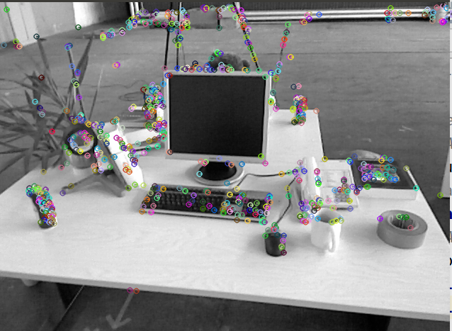

# 第五章作业

作者：曾是少年

## 二 ORB特征点

`ORB(Oriented FAST and BRIEF)` 特征是 SLAM 中一种很常用的特征，由于其二进制特性，使得它可以非常快速地提取与计算 [1]。下面，你将按照本题的指导，自行书写 ORB 的**提取**、**描述子的计算**以及**匹配**的代码。

代码框架参照 `computeORB.cpp` 文件，图像见 `1.png` 文件和 `2.png`。

### 2.1 ORB提取

ORB 即 `Oriented FAST` 简称。它实际上是 `FAST` 特征再加上一个旋转量。本习题将使用 `OpenCV` 自带的 FAST 提取算法，但是你要完成旋转部分的计算。旋转的计算过程描述如下 [2]：在一个小图像块中，先计算质心。质心是指以图像块灰度值作为权重的中心。

1. 在一个小的图像块 B 中，定义图像块的矩为：
$$
m_{pq} = \Sigma_{x,y\in B}x^py^qI(x, y), p, q = \{0, 1\}.
$$
2. 通过矩可以找到图像块的质心：
$$
  C = (\frac{m_{10}}{m_{00}},\frac{m_{01}}{m_{00}})
$$
3.  连接图像块的几何中心 O 与质心 C，得到一个方向向量$\rightarrow_{OC}$，于是特征点的方向可以定义为：
  $$
  θ = \arctan(m_{01}/m_{10}).
  $$
  实际上只需计算 $m_{01}$ 和 $m_{10}$ 即可。习题中取图像块大小为 `16x16`，即对于任意点 $(u, v)$，图像块从$  (u − 8, v − 8)$ 取到 $(u + 7, v + 7) $即可。请在习题的 `computeAngle `中，为所有特征点计算这个旋转角。
 提示：
  
  1. 由于要取图像 16x16 块，所以位于边缘处的点（比如 u < 8 的）对应的图像块可能会出界，此时需要判断该点是否在边缘处，并跳过这些点。
  2. 由于矩的定义方式，在画图特征点之后，角度看起来总是指向图像中更亮的地方。
  3. `std::atan` 和 `std::atan2` 会返回弧度制的旋转角，但 `OpenCV` 中使用角度制，如使用 `std::atan` 类函数，请转换一下。
  
  作为验证，第一个图像的特征点如图 1 所示。看不清可以放大看。
  
  
  
  图 1: 带有旋转的 FAST
  
  
  
    
    图 2: 匹配图像

### 2.2 ORB 描述

### 2.3 暴力匹配