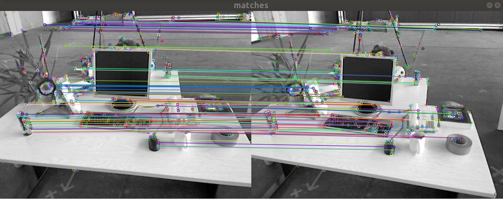
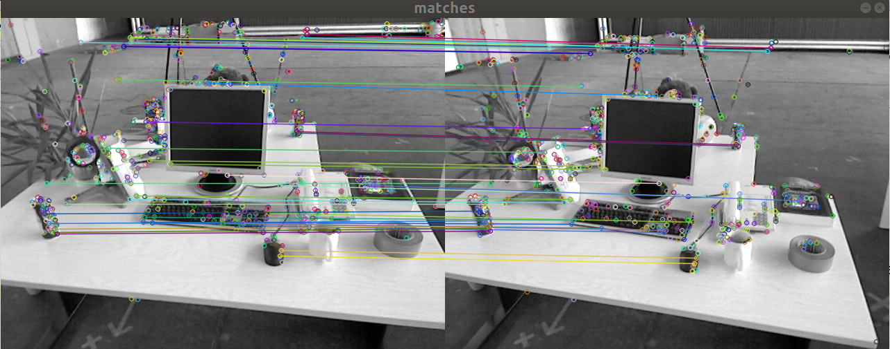

<<<<<<< HEAD
# 第五章作业
=======
# 第五章作业

作者：曾是少年

## 二 ORB特征点

`ORB(Oriented FAST and BRIEF)` 特征是 SLAM 中一种很常用的特征，由于其二进制特性，使得它可以非常快速地提取与计算 [1]。下面，你将按照本题的指导，自行书写 ORB 的**提取**、**描述子的计算**以及**匹配**的代码。

代码框架参照 `computeORB.cpp` 文件，图像见 `1.png` 文件和 `2.png`。

### 2.1 ORB提取

ORB 即 `Oriented FAST` 简称。它实际上是 `FAST` 特征再加上一个旋转量。本习题将使用 `OpenCV` 自带的 FAST 提取算法，但是你要完成旋转部分的计算。旋转的计算过程描述如下 [2]：在一个小图像块中，先计算质心。质心是指以图像块灰度值作为权重的中心。

1. 在一个小的图像块 B 中，定义图像块的矩为：
$$
m_{pq} = \Sigma_{x,y\in B}x^py^qI(x, y), p, q = \{0, 1\}.
$$
2. 通过矩可以找到图像块的质心：
$$
  C = (\frac{m_{10}}{m_{00}},\frac{m_{01}}{m_{00}})
$$
3.  连接图像块的几何中心 O 与质心 C，得到一个方向向量$\rightarrow_{OC}$，于是特征点的方向可以定义为：
$$
  θ = \arctan(m_{01}/m_{10}).
$$
  实际上只需计算 $m_{01}$ 和 $m_{10}$ 即可。习题中取图像块大小为 `16x16`，即对于任意点 $(u, v)$，图像块从$  (u − 8, v − 8)$ 取到 $(u + 7, v + 7) $即可。请在习题的 `computeAngle `中，为所有特征点计算这个旋转角。
 提示：

  1. 由于要取图像 16x16 块，所以位于边缘处的点（比如 u < 8 的）对应的图像块可能会出界，此时需要判断该点是否在边缘处，并跳过这些点。
  2. 由于矩的定义方式，在画图特征点之后，角度看起来总是指向图像中更亮的地方。
  3. `std::atan` 和 `std::atan2` 会返回弧度制的旋转角，但 `OpenCV` 中使用角度制，如使用 `std::atan` 类函数，请转换一下。

  作为验证，第一个图像的特征点如图 1 所示。看不清可以放大看。


  图 1: 带有旋转的 FAST

---

**答**：**计算角度**的过程在题目中已经讲的很清楚了，代码如下：

```C++
void computeAngle(const cv::Mat &image, vector<cv::KeyPoint> &keypoints) {
    int half_patch_size = 8,count=0;
    for (auto &kp : keypoints) {
        // START YOUR CODE HERE (~7 lines)
        kp.angle = 0; // compute kp.angle
        float u = kp.pt.x,v = kp.pt.y;;
        double m01=0,m10=0;
        if((u>=half_patch_size) && (u+half_patch_size)<=image.cols &&(v>=half_patch_size)&& (v+half_patch_size)<=image.rows){
            for (int i = -half_patch_size; i < half_patch_size; ++i) {
                for (int j = -half_patch_size; j < half_patch_size; ++j) {
                    m01 += (j) * image.at<uchar>(v + j, u + i) ;
                    m10 += (i) * image.at<uchar>(v + j, u + i) ;
                }
            }
            kp.angle = atan2(m01 , m10) / pi *180;
        }
    }
    return;
}
```

其中，需要注意的点如下(学习自网络)：

1. 关于`KeyPoint`，其内含一个`Point2f`对象存储`xy`值，用`.pt`获取，含有一个`angle`值也可直接获取。另外还有`size`，`response`，`octave`，`class_id`等其他特征点或者分类任务会用到的域。
2. `math.h`库中：
   
   * `atan` 给斜率求正切，仅对`-90°，-90°`有效
   * `atan2`给两点值，值域为整个圆 `-180°——180°`，(**本题中应该使用`atan2`**)
   * 另外注意角度弧度转换，`angle`存储度数，`atan`使用弧度
3. 质心`m10`和`m01`:
   * 累加时乘在前面的值可以是绝对坐标`p.x+j`或`p.y+i`，也可以用j和i的相对坐标。
   * 使用相对坐标的质心有优势：在求`cx`和`cy`时，如果是绝对坐标，那么`m00`每一步也必须乘上`p.x`和`p.y`，并且算出来是绝对质心计算角度还需要做一次差，相对坐标可以避免多步乘法和减法运算。
   
   

### 2.2 ORB 描述

<<<<<<< HEAD
<<<<<<< HEAD
### 2.3 暴力匹配
>>>>>>> b7402b8e64d354a5886166fc57c6961c210fe69c
=======
​	ORB 描述即带旋转的 BRIEF 描述。所谓 BRIEF 描述是指一个 0-1 组成的字符串（可以取 256 位或128 位），每一个 bit 表示一次像素间的比较。算法流程如下：
=======
​	ORB 描述即**带旋转的 BRIEF 描述**。所谓 BRIEF 描述是指一个 0-1 组成的字符串（可以取 256 位或128 位），每一个 bit 表示一次像素间的比较。算法流程如下：
>>>>>>> 999ace7d04d0ee42bac11b1131594a07e5a14c6b

1. 给定图像 I 和关键点 (u, v)，以及该点的转角 θ。以 256 位描述为例，那么最终描述子
   $$
   d = [d_1, d_2, ..., d_{256}].
   $$

2. 对任意 $i = 1, . . . , 256$，$d_i$ 的计算如下。取 (u, v) 附近任意两个点 p, q，并按照 θ 进行旋转：
   $$
   \left[
   \begin{array}{ccc}
   u'_p\\
   v_p'
   \end{array}
   \right]
   =
   \left[
   \begin{array}{ccc}
   cos \theta & -sin\theta\\
   sin \theta & cos\theta
   \end{array}
   \right]
   \left[
   \begin{array}{ccc}
   u_p\\
   v_p
   \end{array}
   \right]
   $$
   其中 $u_p$,$ v_p$ 为 p 的坐标，对 q 亦然。记旋转后的 p, q 为 p′, q′，那么比较 $I(p′) $和 $I(q′)$，若前者大，记 $d_i = 0$，反之记 $d_i = 1$。

这样我们就得到了 ORB 的描述。我们在程序中用 256 个 `bool` 变量表达这个描述2。请你完成 `computeORBDesc` 函数，实现此处计算。注意，通常我们会固定 p, q 的取法（称为 ORB 的 pattern），否则每次都重新随机选取，会使得描述不稳定。我们在全局变量 `ORB_pattern` 中定义了 p, q 的取法，格式为$u_p, v_p, u_q, v_q$。请你根据给定的 pattern 完成 `ORB` 描述的计算。

**提示**

1. p, q 同样要做边界检查，否则会跑出图像外。如果跑出图像外，就设这个描述子为空。
2. 调用 `cos` 和 `sin` 时同样请注意弧度和角度的转换。

---

**答：**

源代码如下所示：

```C++
void computeORBDesc(const cv::Mat &image, vector<cv::KeyPoint> &keypoints, vector<DescType> &desc) {
    for (auto &kp: keypoints) {
        DescType d(256, false);
        for (int i = 0; i < 256; i++) {
            // START YOUR CODE HERE (~7 lines)
            d[i] = 0;  // if kp goes outside, set d.clear()
            double cos_ = cos(kp.angle /180 * pi),sin_ = sin(kp.angle /180 * pi);

            cv::Point2f up_t(cos_ * ORB_pattern[4 * i] - sin_ * ORB_pattern[4 * i + 1],
                 sin_ * ORB_pattern[4 * i] + cos_ * ORB_pattern[4 * i + 1]);
            cv::Point2f uq_t(cos_ * ORB_pattern[4 * i + 2] - sin_ * ORB_pattern[4 * i + 3],
                             sin_ * ORB_pattern[4 * i + 2] + cos_* ORB_pattern[4 * i + 3]);
            //求作比较两点的坐标
            cv::Point2f up = up_t + kp.pt;
            cv::Point2f uq = uq_t + kp.pt;
            //出界点把特征向量清空,并且不计入总数
            if (up.x < 0 || up.y < 0 || up.x > image.cols || up.y > image.rows ||
                uq.x < 0 || uq.y < 0 || uq.x > image.cols || uq.y > image.rows) {
                d.clear();
                break;// if kp goes outside, set d.clear()
            }
            d[i] = image.at<uchar>(up) > image.at<uchar>(uq) ? 0 : 1;
            // END YOUR CODE HERE
        }
        desc.push_back(d);
    }

    int bad = 0;
    for (auto &d: desc) {
        if (d.empty()) bad++;
    }
    cout << "bad/total: " << bad << "/" << desc.size() << endl;
    return;
}
```


### 2.3 暴力匹配

​	在提取描述之后，我们需要根据描述子进行匹配。暴力匹配是一种简单粗暴的匹配方法，在特征点不多时很有用。下面你将根据习题指导，书写暴力匹配算法。
​	所谓暴力匹配思路很简单。给定两组描述子 `P = [p_1, . . . , p_M]` 和 `Q = [q_1, . . . , q_N ]`。那么，对 `P` 中意一个点，找到 Q 中对应最小距离点，即算一次匹配。但是这样做会对每个特征点都找到一个匹配，所以我们通常还会限制一个距离阈值 `dmax`，即认作匹配的特征点距离不应该大于 `dmax`。下面请你根据上述描述，实现函数 `bfMatch`，返回给定特征点的匹配情况。实践中取 `dmax = 50`。

**提示**：

1. 你需要按位计算两个描述子之间的汉明距离。
2. `OpenCV` 的 `DMatch` 结构，`queryIdx` 为第一图的特征 `ID`，`trainIdx` 为第二个图的特征 `ID`。
3. 作为验证，匹配之后输出图像应如图 2 所示。


​    图 2	匹配图像

---

**答：**

源代码如下所示：

```C++
void bfMatch(const vector<DescType> &desc1, const vector<DescType> &desc2, vector<cv::DMatch> &matches) {
    int d_max = 50;
    // START YOUR CODE HERE (~12 lines)
    // find matches between desc1 and desc2.
    for (size_t i = 0; i < desc1.size(); ++i){
        if(desc1[i].empty()) continue;
        int d_min=256;
        int index2=-1;
        for(size_t j=0;j < desc2.size();j++){
            if(desc2[j].empty())continue;
            int dist=0;
            for(size_t k=0;k<256;k++){
                dist+=desc1[i][k]^desc2[j][k];
            }
            if(dist<d_max&&dist<d_min){
                d_min=dist;
                index2=j;
            }
        }
        if(d_min<d_max){
            matches.push_back(cv::DMatch(i,index2,d_min));
        }
    }
}
```

运行结果，截图：

当最大阈值设为50的时候，得到特征点如下图：


匹配结果如下图：




### 最后，请结合实验，回答下面几个问题：

#### 1. 为什么说 `ORB` 是一种二进制特征？

**答**：ORB使用二进制向量描述了像素点与周围区域的关系（即BRIEF）描述子，根据实验可以看出这一点。

#### 2. 为什么在匹配时使用 `50` 作为阈值，取更大或更小值会怎么样？

**答**：可以看到阈值为50时，检测的特征点对依然存在部分误匹配。

当阈值为50的时候，可以检测出的特征对有95个匹配的特征对。但存在一些误匹配的点对。


当阈值为40的时候，可以检测到`39`个特征点对,得到的特征点对较少；



当阈值为60的时候，可以检测到`matches: 174`的特征点对，同时误匹配也增加了一些.


当阈值设置为100时,可以检测到593个点对,误匹配很多.


#### 3. 暴力匹配在你的机器上表现如何？你能想到什么减少计算量的匹配方法吗？

**答：**暴力匹配在机器上运行时间较长，在真正的SLAM过程中可能导致效率低下的问题。

运行截图如下:


两帧之间的特征匹配使用了大约3000ms,用时比较长.

1. 针对效率提升,可以想到的方法包括：对各个特征点限制匹配搜索的区域；使用光流或者直接法进行计算等。
2. 针对误匹配,可以使用RANSAC等算法进行后处理去除部分无匹配.


## 三 从 E 恢复 `R, t`

我们在书中讲到了单目对极几何部分，可以通过本质矩阵 E，得到旋转和平移 R, t，但那时直接使用了`OpenCV` 提供的函数。本题中，请你根据数学原理，完成从 E 到 R, t 的计算。程序框架见 `code/E2Rt.cpp`.
设 Essential 矩阵 E 的取值为（与书上实验数值相同）：
$$
E =
\left[
\begin{array}{ccc}
−0.0203618550523477 & −0.4007110038118445 & −0.03324074249824097\\
0.3939270778216369 & −0.03506401846698079 & 0.5857110303721015\\
−0.006788487241438284 & −0.5815434272915686 & −0.01438258684486258
\end{array}
\right]
$$

. 请计算对应的 R, t，流程如下：

1. 对 `E` 作 `SVD` 分解：
$$
  E = UΣV^T.
$$

2. 处理 Σ 的奇异值。设 $Σ = diag(σ_1, σ_2, σ_3)$ 且 $σ_1 ≥ σ_2 ≥ σ_3$，那么处理后的 $Σ$ 为：
   $$
   Σ = diag(\frac{σ_1 + σ_2}{2},\frac{σ_1 + σ_2}2, 0).
   $$

3. 共存在四个可能的解：
   $$
   t^∧_1 = UR_Z(\frac{π}2)ΣU^T, R_1 = UR^T_Z(\frac{π}2)V^T\\
   t^∧_2 = UR_Z(−\frac{π}2)ΣU^T,R_2 = UR^T_Z(−\frac{π}2)V^T.
   $$
   表示$R_z(\pi/2)$沿 `Z` 轴旋转 `90` 度得到的旋转矩阵。同时，由于 `−E` 和` E` 等价，所以对任意一个 `t` 或 `R` 取负号，也会得到同样的结果。因此，从 E 分解到 t, R 时，一共存在四个可能的解。请打印这四个可能的 R, t。

   提示：用 `AngleAxis` 或 `Sophus::SO3` 计算 $R_Z(π/2)$。
   注：实际当中，可以利用深度值判断哪个解是真正的解，不过本题不作要求，只需打印四个可能的解即可。同时，你也可以验证 $t^∧R$ 应该与 E 只差一个乘法因子，并且与书上的实验结果亦只差一个乘法因子。

---

**答**：解答本题的过程在题目中已经很清楚了，需要注意的点如下：

1. `Eigen`库中调用`SVD`分解的方法如下所示：

   ```C++
   Eigen::JacobiSVD<Eigen::Matrix3d> svd(E,ComputeThinU|ComputeThinV);
   Matrix3d V=svd.matrixV(),U=svd.matrixU();
   Matrix3d un_S=U.inverse()* E*V.transpose().inverse(); 
   ```

2. 使用旋转向量对旋转矩阵进行赋值的方法：

   ```C++
   AngleAxisd V1(M_PI / 2, Vector3d(0, 0, 1));
   ```

3. 根据线性方程解出的 E，可能不满足 E 的内在性质——它的奇异值不一定为 `σ, σ, 0` 的形式。这时，我们会刻意地把 Σ 矩阵调整成上面的样子。通常的做法是，对八点法求得的 E 进行 SVD 分解后，会得到奇异值矩阵 `Σ = diag(σ1, σ2, σ3)`，不妨设$\delta_1\geq\delta_2\geq\delta_3$, 要取设置为
   $$
   Σ = diag(\frac{σ_1 + σ_2}{2},\frac{σ_1 + σ_2}2, 0).
   $$
   这相当于是把求出来的矩阵投影到了 E 所在的流形上。当然，更简单的做法是将奇异值矩阵取成`diag(1, 1, 0)`，因为 E 具有尺度等价性，所以这样做也是合理的。

**源代码如下**：

```C++
// 给定Essential矩阵
Matrix3d E;
E << -0.0203618550523477, -0.4007110038118445, -0.03324074249824097,
0.3939270778216369, -0.03506401846698079, 0.5857110303721015,
-0.006788487241438284, -0.5815434272915686, -0.01438258684486258;

// 待计算的R,t
Matrix3d R;
Vector3d t;

// SVD and fix sigular values
// START YOUR CODE HERE
Eigen::JacobiSVD<Eigen::Matrix3d> svd(E,ComputeThinU|ComputeThinV);
Matrix3d V=svd.matrixV(),U=svd.matrixU();
Matrix3d un_S=U.inverse()* E*V.transpose().inverse(); //类型不要搞混
//计算后的Sigma矩阵
double delta_1=un_S(0,0),delta_2=un_S(1,1);
Matrix3d S = Matrix3d::Zero();
S(0,0)=(delta_1+delta_2)/2;
S(1,1)=(delta_1+delta_2)/2;
// END YOUR CODE HERE

// set t1, t2, R1, R2 
// START YOUR CODE HERE
Matrix3d t_wedge1;
Matrix3d t_wedge2;

Matrix3d R1;
Matrix3d R2;
// 使用旋转的角度和旋转轴向量（此向量为单位向量）来初始化角轴
AngleAxisd V1(M_PI / 2, Vector3d(0, 0, 1));
AngleAxisd V2(- M_PI / 2, Vector3d(0, 0, 1));

Matrix3d Rz_pos = V1.toRotationMatrix();
Matrix3d Rz_neg = V2.toRotationMatrix();
t_wedge1 = U*Rz_pos*S*U.transpose();
t_wedge2 = U*Rz_neg*S*U.transpose();
R1 = U*Rz_pos*V.transpose();
R2 = U*Rz_neg*V.transpose();
// END YOUR CODE HERE
cout << "R1 = " << R1 << endl;
cout << "R2 = " << R2 << endl;
cout << "t1 = " << Sophus::SO3::vee(t_wedge1) << endl;
cout << "t2 = " << Sophus::SO3::vee(t_wedge2) << endl;
```

计算结果：

```cmd
R1 =  -0.998596  0.0516992 -0.0115267
-0.0513961   -0.99836 -0.0252005
 0.0128107  0.0245727  -0.999616
R2 =   -0.365887  -0.0584576    0.928822
-0.00287462    0.998092   0.0616848
   0.930655  -0.0198996    0.365356
t1 =  -0.581301
-0.0231206
  0.401938
t2 =  0.581301
0.0231206
-0.401938
t^R =  0.0203619   0.400711  0.0332407
 -0.393927   0.035064  -0.585711
0.00678849   0.581543  0.0143826
```

通过以上结果，可以看出$t^{\wedge}R=-E$,相差了一个乘法因子。
<<<<<<< HEAD
>>>>>>> a676a0140f8a43c17631b892991ca6a2d1d08424
=======


## 四 用 G-N 实现 Bundle Adjustment 中的位姿估计 

`Bundle Adjustment` 并不神秘，它仅是一个目标函数为重投影误差的最小二乘。我们演示了 `BundleAdjustment` 可以由 `Ceres` 和 `g2o` 实现，并可用于 `PnP` 当中的位姿估计。本题，你需要自己书写一个高斯牛顿法，实现用 `Bundle Adjustment` 优化位姿的功能，求出相机位姿。严格来说，这是 `Bundle Adjustment`的一部分，因为我们仅考虑了位姿，没有考虑点的更新。完整的 BA 需要用到矩阵的稀疏性，我们留到第七节课介绍。
假设一组点的 3D 坐标为 $P = {p_i}$，它们在相机中的坐标为 $U = {u_i}, ∀i = 1, . . . n$。在文件 `p3d.txt`和 `p2d.txt` 中给出了这两组点的值。同时，设待估计的位姿为 `T ∈ SE(3)`，内参矩阵为：
$$
K=
\left[
\begin{array}{ccc}
520.9&0&325.1\\
0&521.0&249.7\\
0&0&1
\end{array}
\right]
$$
请你根据上述条件，用 `G-N` 法求出最优位姿，初始估计为 $T_0 = I$。程序 `GN-BA.cpp` 文件提供了大致的框架，请填写剩下的内容。
在书写程序过程中，回答下列问题：

---

### 1. 如何定义重投影误差？

第i个投影点的误差为：
$$
e_i =u_i-\frac{1}{s_i}K\exp(\xi^{\wedge})P_i
$$
其中，$u_i$是3D空间点$P_i$在归一化平面上的投影点，K是内参矩阵，$\xi$是位资的李代数表示.

整体的重投影误差如下：
$$
\begin{aligned}
e &= \frac{1}{2}\sum^n_{i=1}||e_i||^2
\\&=\frac{1}{2}\sum^n_{i=1}||u_i-\frac{1}{s_i}K\exp(\xi^{\wedge})P_i||^2
\end{aligned}
$$

程序中，重投影误差的计算代码如下：

```C++
Vector3d P = T_esti.rotation_matrix()*p3d[i]+T_esti.translation();
// Vector3d P = T_esti*p3d[i];
double x = P[0];
double y = P[1];
double z = P[2];
Vector3d P_e = K*P/z;
Vector2d e(p2d[i].x()-P_e.x(),p2d[i].y()-P_e.y());
cost += e.transpose()*e;
```

计算重投影误差的过程如下：

1. 先把世界坐标系中的3d空间点**投影**到像素坐标系；
2. 把像素坐标点与2d点**做差**以计算每个点的重投影误差；
3. **累加误差**得到所有点的重投影误差。


---

### 2.该误差关于自变量的雅可比矩阵是什么？

自变量是位姿的李代数 $\xi$。

**计算过程**

1. 线性化重投影误差

$$
e(x+\Delta x)\approx e(x)+J\Delta x
$$

2. 重投影误差如下：
   $$
   \begin{aligned}
   e &= \frac{1}{2}\sum^n_{i=1}||e_i||^2
   \\&=\frac{1}{2}\sum^n_{i=1}||u_i-\frac{1}{s_i}K\exp(\xi^{\wedge})P_i||^2
   \end{aligned}
   $$

3. 雅克比矩阵计算如下：

$$
\begin{aligned}
\frac{\partial e}{\partial \delta \xi} = 
\frac{\partial e}{\partial P'}
\frac{\partial P'}{\partial \delta \xi} &=
-
\left[
\begin{array}{ccc}
\frac{fx}{Z'} & 0 & -\frac{f_xX'}{Z'^2}\\
0 & \frac{fy}{Z'} &  -\frac{f_yY'}{Z'^2}\\
\end{array}
\right]
\left[
\begin{array}{ccc}
I,-P'^{\wedge}
\end{array}
\right]
\\ 
&=
-\left[
\begin{array}{ccc}
\frac{fx}{Z'} & 0 & -\frac{f_xX'}{Z'^2}\\
0 & \frac{fy}{Z'} &  -\frac{f_yY'}{Z'^2}\\
\end{array}
\right]
\left[
\begin{array}{ccc}
1 & 0 & 0 & 0   & Z' & -Y'\\
0 & 1 & 0 & -Z' & 0 & X'\\
0 & 0 & 1 &  Y' & -X' & 0
& &
\end{array}
\right]
\\
H=\frac{\partial{e}}{\partial \xi} &= -
\left[
\begin{array}{ccc}
\frac{f_x}{Z'} & 0 & \frac{f_xX'}{Z'^2} & -\frac{f_xX'Y'}{Z'^2} & f_x+\frac{f_xX^2}{Z'^2} & -\frac{f_xY'}{Z'}\\
0 & \frac{f_y}{Z'} & \frac{f_yY'}{Z'^2} & -f_y-\frac{f_yX'Y'}{Z'^2} & \frac{f_y X^2}{Z'^2} & -\frac{f_yY'}{Z'}\\
\end{array}
\right]
\end{aligned}
$$


程序中计算雅克比矩阵的源代码如下W：

```C++
Matrix<double, 2, 6> J;
// START YOUR CODE HERE

J(0,0) = fx/z;
J(0,1) = 0;
J(0,2) = -fx*x/(z*z);

J(0,3) = -fx*x*y/(z*z);
J(0,4) = fx+fx*x*x/(z*z);
J(0,5) = -fx*y/z;

J(1,0) = 0;
J(1,1) = fy/z;
J(1,2) = -fy*y/(z*z);

J(1,3) = -fy-fy*y*y/(z*z);
J(1,4) = fy*x*y/(z*z);
J(1,5) = fy*x/z;
J = -J;

// END YOUR CODE HERE
```

---

### 3. 解出更新量之后，如何更新至之前的估计上？

作为验证，最后估计得到的位姿应该接近：
$$
T^*=
\left[
\begin{array}{ccc}
0.9978&−0.0517&0.0399&−0.1272\\
0.0506&0.9983&0.0274&−0.007\\
−0.0412&−0.0253&0.9977&0.0617\\
0&0&0&1
\end{array}
\right]
$$
这和书中使用 `g2o`优化的结果很接近。

**答**：将得到的更新量`dx`

源代码如下：

```C++
Vector6d dx;
// START YOUR CODE HERE 
dx = H.ldlt().solve(b);
// END YOUR CODE HERE
T_esti *=  Sophus::SE3::exp(dx); //更新估计
```

注意点：

1. 使用`Vetor6d`得到李代数的方法

   ```C++
   Sophus::se3 T = Sophus::SE3::exp(dx);
   ```


最后的程序运行截图如下：


结果与题目给出的验证结果相近。


## 附加题* 五 用 ICP 实现轨迹对齐 

在实际当中，我们经常需要比较两条轨迹之间的误差。第三节课习题中，你已经完成了两条轨迹之间的 RMSE 误差计算。但是，由于 ground-truth 轨迹与相机轨迹很可能不在一个参考系中，它们得到的轨迹并不能直接比较。这时，我们可以用 ICP 来计算两条轨迹之间的相对旋转与平移，从而估计出两个参考系之间的差异。

图 3: vicon 运动捕捉系统，部署于场地中的多个红外相机会捕捉目标球的运动轨迹，实现快速定位。
设真实轨迹为 $T_g$，估计轨迹为 $T_e$，二者皆以 $T_{WC}$ 格式存储。但是真实轨迹的坐标原点定义于外部某参考系中（取决于真实轨迹的采集方式，如 Vicon 系统可能以某摄像头中心为参考系，见图 3），而估计轨迹则以相机出发点为参考系（在视觉 SLAM 中很常见）。由于这个原因，理论上的真实轨迹点与估计轨迹点应满足：

Tg,i = TgeTe,i (4)
其中 i 表示轨迹中的第 i 条记录，Tge ∈ SE(3) 为两个坐标系之间的变换矩阵，该矩阵在整条轨迹中保持
不变。Tge 可以通过两条轨迹数据估计得到，但方法可能有若干种：

1. 认为初始化时两个坐标系的差异就是 Tge，即：
$$
  T_{ge} = T_{g,1}T^{−1}_{e,1}
$$

2. 在整条轨迹上利用最小二乘计算 Tge：
$$
  T_{ge} = \arg \min_{T_{ge}} \sum^{n}_{i=1}||
  \log (T^{−1}_{gi} T_{ge}T_{e,i})^∨
  ||_2
$$


3. 把两条轨迹的平移部分看作点集，然后求点集之间的 ICP，得到两组点之间的变换。
其中第三种也是实践中用的最广的一种。现在请你书写 ICP 程序，估计两条轨迹之间的差异。轨迹文件在 `compare.txt` 文件中，格式为：`timee, te, qe,timeg, tg, qg`。

其中 `t` 表示平移，`q` 表示单位四元数。请计算两条轨迹之间的变换，然后将它们统一到一个参考系，并画在 `pangolin` 中。轨迹的格式与先前相同，即以时间，平移，旋转四元数方式存储。
本题不提供代码框架，你可以利用之前的作业完成本题。图 4 显示了对准前与对准后的两条轨迹。


答：代码过程如下：

1. **读取文件得到轨迹**

```C++
    vector<Sophus::SE3, Eigen::aligned_allocator<Sophus::SE3>> esti_poses;
    vector<Sophus::SE3, Eigen::aligned_allocator<Sophus::SE3>> ground_truth_poses;
    //读取文件
    fstream INFILE("compare.txt");
    double time,t_x,t_y,t_z,q_x,q_y,q_z,q_w;
    while(!INFILE.eof())
    {
        INFILE>>time;
        INFILE>>t_x;
        INFILE>>t_y;
        INFILE>>t_z;
        INFILE>>q_x;
        INFILE>>q_y;
        INFILE>>q_z;
        INFILE>>q_w;
        esti_poses.push_back(Sophus::SE3(Eigen::Quaterniond(q_w,q_x,q_y,q_z),Eigen::Vector3d(t_x,t_y,t_z)));
        INFILE>>time;
        INFILE>>t_x;
        INFILE>>t_y;
        INFILE>>t_z;
        INFILE>>q_x;
        INFILE>>q_y;
        INFILE>>q_z;
        INFILE>>q_w;
        ground_truth_poses.push_back(Sophus::SE3(Eigen::Quaterniond(q_w,q_x,q_y,q_z),Eigen::Vector3d(t_x,t_y,t_z)));
    }
```

2. **计算质心及去质心坐标**

```C++
Eigen::Vector3d center_et(0,0,0);//估计出轨迹的质心
Eigen::Vector3d center_gd(0,0,0);//groundtruth的质心
for(int i = 0;i<esti_poses.size();i++)
{
    center_et+=esti_poses[i].translation();
    center_gd+=ground_truth_poses[i].translation();
}
center_et /= s;
center_gd /= s;

vector<Vector3d> t_esti;
vector<Vector3d> t_gd;
for(int i = 0;i<s;i++)
{
    t_esti.push_back(esti_poses[i].translation()-center_et);
    t_gd.push_back(ground_truth_poses[i].translation()-center_gd);
}
```


3. 根据优化问题**计算旋转矩阵R**（使用SVD分解进行计算得到）

```C++
Matrix3d R; //待估计R
Matrix3d W;
W.setZero();
cout<<W<<endl;
//A.SVD方法
for(int i = 0;i<s;i++)
    W+=t_gd[i]*t_esti[i].transpose();
Eigen::JacobiSVD<Eigen::Matrix3d> svd(W,ComputeThinU|ComputeThinV);
Matrix3d V=svd.matrixV(),U=svd.matrixU();
R=U*V.transpose();

cout<<"R:"<<endl<<R<<endl;
```

4. **根据R计算t**

```C++
Vector3d t;
t = center_gd - R*center_et;
```

5. 用计算出的R，t将轨迹投影后，**画出轨迹**

```c++
vector<Sophus::SE3, Eigen::aligned_allocator<Sophus::SE3>> truth_poses_rt;
R=R.inverse();
t=-R*t;
for(int i = 0;i<s;i++)
{
    Sophus::SE3 p_rt;
    p_rt = Sophus::SE3(R,t)*ground_truth_poses[i];
    truth_poses_rt.push_back(p_rt);
}
DrawTrajectory(truth_poses_rt,esti_poses);
```

得到的结果如下图所示：

对齐前的结果如下图所示：


* 红色表示groundtruth轨迹

* 蓝色表示估计出的轨迹

对齐后的结果如下所示（本次实验中，将groundtruth轨迹与估计出的轨迹对齐，）


>>>>>>> 999ace7d04d0ee42bac11b1131594a07e5a14c6b
