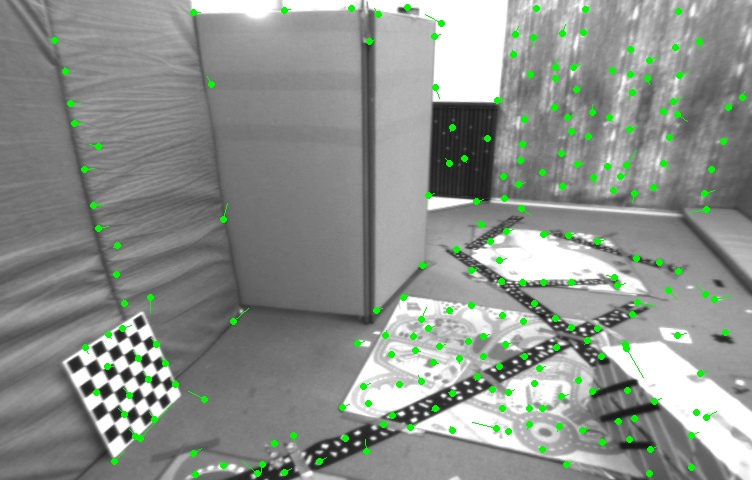
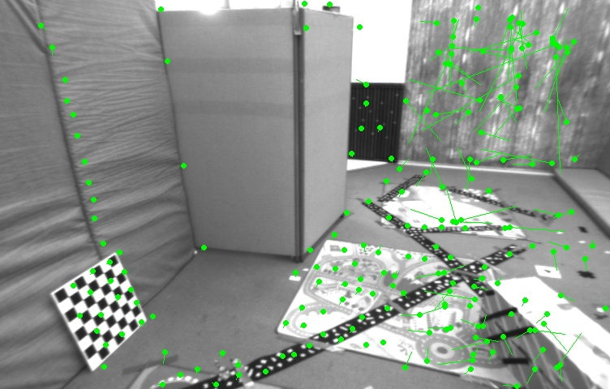
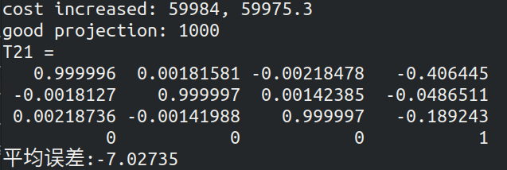
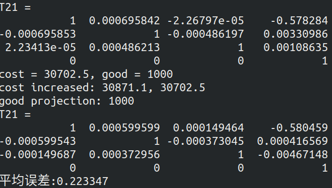

# 第六章作业

作者: 曾是少年

## 二 LK光流

### 2.1 光流文献综述 (1 分)

我们课上演示了 `Lucas-Kanade` 稀疏光流，用 OpenCV 函数实现了光流法追踪特征点。实际上，光流法有很长时间的研究历史，直到现在人们还在尝试用 Deep learning 等方法对光流进行改进 [1, 2]。本题将指导你完成基于 Gauss-Newton 的金字塔光流法。首先，请阅读文献 [3]（paper 目录下提供了 pdf），回答下列问题。
**问题：**

#### 1. 按此文的分类，光流法可分为哪几类？

答：作者在文中对光流法按照两种不同的方法进行分类。

原文中如下：

​	One difference between the various approaches is whether they estimate an additive increment to the parameters (the additive approach (Lucas and Kanade, 1981)), or whether they estimate an incremental warp that is then composed with the current estimate of the warp (the compositional approach (Shum and Szeliski, 2000)).

原文第一章最后一段有如下：

​	We categorize algorithms as either additive or compositional, and as either forwards or inverse.

1. 可以看出，此文按照估计的是**参数的叠加增量**还是**增量`Warp`**将光流法分为**叠加法**(`additional`)和**组合**(`compositional`)算法
2. 按照**Warp更新规则**可以将光流法分为**前向**（`forward`）和**逆向**(`inverse`)两种算法

#### 2. 在 compositional 中，为什么有时候需要做原始图像的 warp？该warp 有何物理意义？

与`Lucas-Kanade` 算法中那样简单地将迭代的更新 $\Delta p$ 添加到当前估计的参数 $p$ 不同，组合（`compositional`）算法中，对扭曲$W(x;\Delta p)$的增量更新必须由`Warp`的当前估计组成 $W(x;p)$。

需要在当前位姿估计之前引入增量式 `warp（incremental warp）`以建立半群约束要求`（the semi-group requirement）`。

原文片段：For more complex warps the composition of the two warps can be more involved (Baker and Matthews, 2001).We therefore have two requirements on the set of warps: (1) the set of warps must contain the identity warp and (2) the set of warps must be closed under composition. The set ofwarps must therefore form a semi-group. This requirement is not very strong. Most warps used in computer vision, including homographies and 3D rotations (Shum and Szeliski, 2000), naturally form semi-groups.

Forward Compositional 的 warp 集合包含 identity warp, warp 集 合 包 含 在Composition 操作上是半群(semi-group), 其中包括 Homograph, 3D rotation 等. Inverse Compositional 也是 semi-group, 另外要求增量 warp 可逆, 其中包括 Homograph, 3D rotation 等, 但不包括 piece wise affine.

#### 3. forward 和 inverse 有何差别？

The only differences between the forwards and inverse compositional algorithms
(see Figs. 3 and 4) are: (1) the error image is computed after switching the roles of I and T , (2) Steps 3, 5, and 6 use the gradient of T rather than the gradient of I and can be pre-computed, (3) Eq. (35) is used to computep rather than Eq. (10), and finally (4) the incremental warp is inverted before it is composed with the current estimate in Step 9.

正向和逆向组合算法之间的唯一区别是：（1）切换I和T的角色后计算误差图像；（2）步骤3、5和6使用梯度 可以预先计算T的T而不是I的梯度，（3）式。 （35）用于计算p而不是等式。 （10），最后是（4）在将增量扭曲与步骤9中的当前估计值组合之前将其反转。

向前方法对于输入图像进行参数化(包括仿射变换及放射增量). 反向方法则同时输入图像参数和模板图像, 其中输入图像参数化仿射变换, 模板图像参数化仿射增量. 因此反向方法的计算量显著降低，计算效率较高.。由于图像灰度值和运动参数非线性, 整个优化过程为非线性。
`forward`方法和`inverse`方法在目标函数上不太一样，一个是把运动向量 p 都是跟着被匹配图像，但是向前方法中的迭代的微小量 Δp 使用 I 计算，反向方法中的 Δp 使用 T计算，这样计算量便小了。


### 2.2 `forward-addtive` `Gauss-Newton` 光流的实现

接下来我们来实现最简单的光流，即上文所说的 `forward-addtive`。我们先**考虑单层图像的 `LK` 光流，然后再推广至金字塔图像**。按照教材的习惯，我们把光流法建模成一个非线性优化问题，再使用 `Gauss-Newton` 法迭代求解。设有图像 `1.png`，`2.png`，我们在 1.png 中提取了 `GFTT 角点` [4] (1 这是一种角点提取算法，没有描述子。经常与光流配合使用，但是计算量比 FAST 更大.)，然后希望在 `2.png`中追踪这些关键点。设两个图分别为 $I_i$, $I_2$，第一张图中提取的点集为 $P = {p_i}$，其中 $p_i = [x_i, y_i]^T$为像素坐标值。考虑第 i 个点，我们希望计算 $∆xi, ∆yi$，满足：
$$
\min_{∆x_i,∆y_i}\sum_W||I_1 (x_i,y_i) − I_2 (x_i + ∆x_i, y_i + ∆y_i)||^2_2
$$

即最小化二者灰度差的平方，其中 $\sum_W$表示我们在某个窗口（Window）中求和（而不是单个像素，因为问题有两个未知量，单个像素只有一个约束，是欠定的）。实践中，取此 `window` 为 `8×8` 大小的小块，即从 $x_i − 4$ 取到 $x_i + 3$，`y` 坐标亦然。显然，这是一个 `forward-addtive` 的光流，而上述最小二乘问题可以用 `Gauss-Newton` 迭代求解。请回答下列问题，并根据你的回答，实现 `code/optical_flow.cpp` 文件中的`OpticalFlowSingleLevel` 函数。

#### 1. 从最小二乘角度来看，每个像素的误差怎么定义？

**答:**
$$
e_i=I_1 (x_i,y_i) − I_2 (x_i + ∆x_i, y_i + ∆y_i)
$$

#### 2. 误差相对于自变量的导数如何定义？

**答:**
$$
\frac{\partial e}{\partial \Delta x}=-(\frac{\partial I_2(x_i + ∆x_i, y_i + ∆y_i)}{\partial \Delta x})
$$

$$
\frac{\partial e}{\partial \Delta y}=-(\frac{\partial I_2(x_i + ∆x, y_i + ∆y)}{\partial \Delta y})
$$
实践中的计算过程如下:

1. 计算雅克比矩阵

```C++
Eigen::Vector2d J;  // Jacobian
J(0) = -0.5*(GetPixelValue(img2,kp.pt.x + x + dx+1,kp.pt.y + y+dy) - GetPixelValue(img2,kp.pt.x + x + dx-1,kp.pt.y + y+dy));
 J(1) = -0.5*(GetPixelValue(img2,kp.pt.x + x + dx,kp.pt.y + y+dy+1) - GetPixelValue(img2,kp.pt.x + x + dx,kp.pt.y + y+dy-1));
```

2. 计算误差

```C++
 error = -double(GetPixelValue(img2,kp.pt.x + x + dx,kp.pt.y + y+dy) - GetPixelValue(img1,kp.pt.x + x ,kp.pt.y + y));
```

3. 计算H,b,cost

```C++
H +=  J*J.transpose();
b += -J*error;
cost += error*error;
```

4. 计算更新

```C++
Eigen::Vector2d update;
update = H.ldlt().solve(b);
// 更新dx,dy
dx += update[0];
dy += update[1];
```

下面是有关实现过程中的一些**提示**：

1. 同上一次作业，你仍然需要去除那些提在图像边界附近的点，不然你的图像块可能越过边界。
2. 该函数称为单层的光流，下面我们要基于这个函数来实现多层的光流。在主函数中，我们对两张图像分别测试单层光流、多层光流，并与 `OpenCV` 结果进行对比。作为验证，正向单层光流结果应该如图 1 所示，它结果不是很好，但大部分还是对的。
3. 在光流中，关键点的坐标值通常是浮点数，但图像数据都是以整数作为下标的。之前我们直接取了浮点数的整数部分，即把小数部分归零。但是在光流中，通常的优化值都在几个像素内变化，所以我们还用浮点数的像素插值。函数 `GetPixelValue` 为你提供了一个**双线性插值**方法（这也是常用的图像插值法之一），你可以用它来获得浮点的像素值。

**正向法运行结果**如下:




感悟:

* 使用函数 `GetPixelValue`进行插值很重要; 我一开始没有使用插值代码如下:

  ```C++
  J(0) = -0.5 * (img2.at<uchar>(kp.pt.x+dx+x+1, kp.pt.y+dy+y)   - img2.at<uchar>(kp.pt.x+dx+x-1, kp.pt.y+dy+y));
  J(1) = -0.5 * (img2.at<uchar>(kp.pt.x+dx+x,   kp.pt.y+dy+y+1) - img2.at<uchar>(kp.pt.x+dx+x,   kp.pt.y+dy+y-1));
  error = -double(img2.at<uchar>(kp.pt.x + x + dx , kp.pt.y + y+dy) - img1.at<uchar>(kp.pt.x + x, kp.pt.y + y));
  ```

  运行结果如下:

  

  可以看出**,不进行插值,效果不会好;**


### 2.3 反向法（1 分）

在你实现了上述算法之后，就会发现，在迭代开始时，`Gauss-Newton` 的计算依赖于 $I_2$ 在 $(x_i+∆x_i, y_i+∆y_i)$ 处的梯度信息。然而，角点提取算法仅保证了 $I_1(x_i, y_i)$ 处是角点（可以认为角度点存在明显梯度），但对于 $I_2$，我们并没有办法假设 $I_2$ 在 $x_i, y_i$ 处亦有梯度，从而 $Gauss-Newton$ 并不一定成立。反向的光流法（`inverse`）则做了一个巧妙的技巧，即用 $I_1(x_i, y_i)$ 处的梯度，替换掉原本要计算的 $I_2(x_i +∆x_i, y_i +∆y_i)$
的梯度。这样做的好处有：

• $I_1(x_i, y_i)$ 是角点，梯度总有意义；
• $I_1(x_i, y_i)$ 处的梯度不随迭代改变，所以只需计算一次，就可以在后续的迭代中一直使用，节省了大量计算时间。

我们为 `OpticalFlowSingleLevel` 函数添加一个 `bool inverse` 参数，指定要使用正常的算法还是反向的算法。请你根据上述说明，完成反向的 `LK` 光流法。

**答:**
$$
error = I_2(x,y)-I_1(x-dx,y-dy)
$$

$$
\frac{\partial e}{\partial dx } = \frac{\partial I_1(x-dx)}{\partial x}
$$

代码修改如下(主要是雅克比矩阵计算过程):

```C++
J(0) = -0.5*(GetPixelValue(img1,kp.pt.x + x + 1 , kp.pt.y + y) - GetPixelValue(img1,kp.pt.x + x - 1 , kp.pt.y + y));
J(1) = -0.5*(GetPixelValue(img1,kp.pt.x + x , kp.pt.y + y + 1) - GetPixelValue(img1,kp.pt.x + x , kp.pt.y + y - 1));
```

使用**反向法**运行结果如下:


刻意看出,效果还不错;

### 2.4 推广至金字塔（2 分）

通过实验，可以看出光流法通常只能估计几个像素内的误差。如果初始估计不够好，或者图像运动太大，光流法就无法得到有效的估计（不像特征点匹配那样）。但是，使用图像金字塔，可以让光流对图像运动不那么敏感。下面请你使用缩放倍率为 2，共四层的图像金字塔，实现 `coarse-to-fine` 的 `LK` 光流。函数在 `OpticalFlowMultiLevel` 中。

**答:**

要点:

1. 使用resize函数进行图像缩放;

代码修改过程如下:

1. 构建图像缩放的金字塔

```C++
// 构建金字塔
vector<Mat> pyr1, pyr2; // image pyramids 图像金字塔
// TODO START YOUR CODE HERE (~8 lines)
for (int i = 0; i < pyramids; i++) {
    if(i==0)
    {
        pyr1.push_back(img1);
        pyr2.push_back(img2);
    }
    else
    {
        Mat dst1,dst2;
        cv::resize(img1, dst1, Size(),scales[i],scales[i]);
        cv::resize(img2, dst2, Size(),scales[i],scales[i]);
        pyr1.push_back(dst1);
        pyr2.push_back(dst2);
        /* code */
    }
    }
```

2. 把所有的特征点经过缩放之后放入特征点集合中

```C++
vector<KeyPoint> kp1_pyr;
vector<KeyPoint> kp2_pyr;
for(auto &kp:kp1)
{
    auto kp_top=kp;
    kp_top.pt *= scales[pyramids-1];
    kp1_pyr.push_back(kp_top);
    kp2_pyr.push_back(kp_top);
}
```

3. 从金字塔上层到下层提取特征点

```C++
for(int level = pyramids-1;level>=0;level--)
{
    success.clear();
    cout<<pyr1.size()<<' '<<level<<endl;
    OpticalFlowSingleLevel(pyr1[level], pyr2[level], kp1_pyr, kp2_pyr, success,true);
    if(level>0)
    {
        for(auto &kp:kp1_pyr)
        {
            kp.pt /= pyramid_scale;
        }
        for(auto &kp:kp2_pyr)
        {
            kp.pt /= pyramid_scale;
        }
    }  
}
```

4. 把提取到的特征都添加到kp2中.

```C++
for(auto &kp:kp2_pyr)
{
    kp2.push_back(kp);
}
```


**金字塔正向**运行结果如下所示:


**金字塔反向**运行结果如下:


`OpenCV`原版结果如下所示:


可以看出使用金字塔的效果比单层的要好.

实现完成后，给出你的光流截图（正向、反向、金字塔正向、金字塔反向），可以和 `OpenCV` 作比较。
然后回答下列问题：

#### 1. 所谓 coarse-to-fine 是指怎样的过程？

**答**:对一个图像按倍率进行缩放,得到不同分辨率的图像. 构成一个图像金字塔. 在计算光流时,从顶层分辨率较低的图像开始计算,然后把上一层的追踪结果,作为下一层的初始值. 依此规律进行迭代,该过程即是**由粗到精(Coarse-to-fine)**的光流.

该方法的优点在于,当原始图像的像素运动较大时,在金字塔顶层的图像看来,运动仍然在一个小范围内

#### 2. 光流法中的金字塔用途和特征点法中的金字塔有何差别？

**答**:

光流法中的金字塔是逐层迭代寻找最佳的关键点位置和光流方向，目的是解决光流在运动过程中难以检测的问题，或者说图像运动过快导致跟踪不上的问题。

特征点法中的金字塔是通过逐层检测特征点来增加尺度描述，有时候图像从远处看是一个特征点，但是近看可能不是，所以特征点法用金字塔目的是解决特征点的尺度不变性问题

提示：你可以使用上面写的单层光流来帮助你实现多层光流。


### 2.5 讨论

现在你已经自己实现了光流，看到了基于金字塔的 `LK`光流能够与`OpenCV` 达到相似的效果（甚至更好）。根据光流的结果，你可以和上讲一样，计算对极几何来估计相机运动。下面针对本次实验结果，谈谈你对下面问题的看法：

#### 1. 我们优化两个图像块的灰度之差真的合理吗？哪些时候不够合理？你有解决办法吗？

**答**: 光流法有三个基本的假设：
a. 灰度不变假设，即同一个空间点的像素灰度值在各个图像中固定不变，看似不太合理，但是当帧率输出较快，两张图像非常接近时，这种假设也凑合；
b. 小运动假设；
c. 局部一致性假设。
其中，基于灰度不变假设容易受外界光照的影响。解决办法可以对相机进行光度模型标定相机发生大尺度或旋转时容易产生局部极值，跟踪效果不好，通常的解决办法可以用金字塔的方法改善局部极值，用组合光流法（增加旋转描述）可以改善旋转问题。

#### 2. 图像块大小是否有明显差异？取 `16x16` 和 `8x8` 的图像块会让结果发生变化吗？

**答**: 当采用了金字塔的方法时，窗口固定，将图像生成金字塔过程中，在每一层金字塔上都用同一个大小的窗口来进行光流计算，这样很好的去解决了图像块的问题，这样一来图像块大小并不会带来明显差异。当没有采用金字塔方法时。当窗口较大时，光流计算更鲁棒，当窗口较小时，光流计算更正确。原因在于，当图像中每一个部分的运动都不一致的时候如果开的窗口过大，很容易违背窗口(邻域)内的所有点光流一致的基本假设，这可能与实际不一致，所以窗口小，包含的像素少，更精确些。

#### 3. 金字塔层数对结果有怎样的影响？缩放倍率呢？

**答**: 金字塔层数一般越多效果越好，但是一般图像大于4~5层之后都变得太小，特征点像素太过紧密容易出现错误追踪。放大倍率的话，放大倍率小，金字塔的层数可以增加，迭代层数增多，效果可以变得更好。

## 三 直接法

### 3.1 单层直接法（3 分）

我们说直接法是光流的直观拓展。在光流中，我们估计的是每个像素的平移（在 additive 的情况下）。
而在直接法当中，我们最小化光流误差，来估计相机的旋转和平移（以李代数的形式）。现在我们将使用和
前一个习题非常相似的做法来实现直接法，请同学体现二者之间的紧密联系。
本习题中，你将使用 Kitti 数据集中的一些图像。给定 `left.png` 和 `disparity.png`，我们知道，通过这两个
图可以得到 `left.png` 中任意一点的 `3D` 信息。现在，请你使用直接法，估计图像 `000001.png` 至 `000005.png`
的相机位姿。我们称 `left.png` 为参考图像（`reference`，简称 `ref`），称 `000001.png` -`000005.png` 中任意一图
为当前图像（`current`，简称 `cur`），如图2 所示。设待估计的目标为 `Tcur`,`ref`，那么在 ref 中取一组点 ${p_i}$，
位姿可以通过最小化下面的目标函数求解：
$$
T_{cur,ref} =\frac{1}{N}\sum^N_{i=1}\sum_{Wi}
||I_{ref}(π(p_i)) − I_{cur}(π (T_{cur,ref }p_i))||^2_2
$$
其中 N 为点数，π 函数为针孔相机的投影函数 
$$
R^3→ R^2
$$
，$W_i$ 为第 i 个点周围的小窗口。同光流法，该问题可由 `Gauss-Newton` 函数求解。请回答下列问题，然后实现 `code/direct_method.cpp` 中的 `DirectPoseEs?timationSingleLayer` 函数。

#### 1. 该问题中的误差项是什么？

$$
error = I_{ref}(\pi(p_i))-I_{cur}(\pi(T_{cur,ref}\pi_i))
$$

#### 2. 误差相对于自变量的雅可比维度是多少？如何求解？

答: 误差是1维的, 自变量T是6维的.

令$q=TP$,$u=\frac{1}{Z_2}Kq$,有
$$
\begin{aligned}
\frac{\partial e}{\partial \delta \xi} &= 
\frac{\partial -I_{cur}(\pi(T_{cur,ref}\pi_i))}{\partial \delta\xi}
\\ &= \frac{\partial (-I_{cur}{(u)})}{\partial u} \frac{\partial u}{\partial q} \frac{\partial q}{\partial \delta \xi} \delta \xi
\\& = -\frac{\partial I_2}{\partial u} \frac{1}{Z}K P \delta \xi
\\& = -\frac{\partial I_2}{\partial u} \frac{\partial u}{\partial \delta \xi}
\\ &=
-\frac{\partial I_2}{\partial u}
\left[
\begin{array}{ccc}
\frac{f_x}{Z} & 0 & -\frac{f_xX}{Z^2} & -\frac{f_xXY}{Z^2} & f_x+\frac{fxX^2}{Z^2} & -\frac{f_xY}{Z}\\
0 & \frac{f_y}{Z} & -\frac{f_yY}{Z^2} & -f_y-\frac{fyY^2}{Z^2} &
\frac{f_yXY}{Z^2} & \frac{f_yX}{Z}\\
\end{array}
\right]
\end{aligned}
$$


#### 3. 窗口可以取多大？是否可以取单个点？

下面是一些实现过程中的提示：

1. 这次我们在参考图像中随机取 1000 个点，而不是取角点。请思考为何不取角点，直接法也能工作。
2. 由于相机运动，参考图像中的点可能在投影之后，跑到后续图像的外部。所以最后的目标函数要对投影在内部的点求平均误差，而不是对所有点求平均。程序中我们以 good 标记出投影在内部的点。
3. 单层直接法的效果不会很好，但是你可以查看每次迭代的目标函数都会下降。

### 3.2 多层直接法（2 分）

下面，类似于光流，我们也可以把直接法以 `coarse-to-fine` 的过程，拓展至多层金字塔。多层金字塔的直接法允许图像在发生较大运动时仍能追踪到所有点。下面我们使用缩放倍率为 2 的四层金字塔，实现金字塔上的直接法。请实现`DirectPoseEstimationMultiLayer` 函数，下面是一些提示：

1. 在缩放图像时，图像内参也需要跟着变化。那么，例如图像缩小一倍，$f_x, f_y, c_x, c_y$ 应该如何变化？
2. 根据 `coarse-to-fine` 的过程，上一层图像的位姿估计结果可以作为下一层图像的初始条件。
3. 在调试期间，可以画出每个点在 ref 和 cur 上的投影，看看它们是否对应。若准确对应，则说明位
    姿估计是准确的。
    作为验证，图像 000001 和 000005 的位姿平移部分应该接近2：
    t1 = [0.005876, −0.01024, −0.725]T
    t5 = [0.0394, −0.0592, −3.9907]T
    (3)
    可以看出车辆基本是笔直向前开的。
    2 根据各人实现不同，此题结果可能有所差异，但不应该大于 0.5 米。
    5

### 3.3 * 延伸讨论

现在你已经实现了金字塔上的 Gauss-Newton 直接法。你可以调整实验当中的一些参数，例如图像点
数、每个点周围小块的大小等等。请思考下面问题：

#### 1. 直接法是否可以类似光流，提出 inverse, compositional 的概念？它们有意义吗？

#### 2. 请思考上面算法哪些地方可以缓存或加速？

#### 3. 在上述过程中，我们实际假设了哪两个 patch 不变？

#### 4. 为何可以随机取点？而不用取角点或线上的点？那些不是角点的地方，投影算对了吗？

#### 5. 请总结直接法相对于特征点法的异同与优缺点。


## 4 * 使用光流计算视差（2 分，约 1 小时）

请注意本题为附加题。
在上一题中我们已经实现了金字塔 `LK` 光流。光流有很多用途，它给出了两个图像中点的对应关系，所以我们可以用光流进行位姿估计，或者计算双目的视差。回忆第四节课的习题中，我们介绍了双目可以通过视差图得出点云，但那时直接给出了视差图，而没有进行视差图的计算。现在，给定图像 `left.png`,` right.png`，请你使用上题的结果，计算 `left.png` 中的 `GFTT` 点在 `right.png` 中的（水平）视差，然后与 `disparity.png` 进行比较。这样的结果是一个稀疏角点组成的点云。请计算每个角点的水平视差，然后对比视差图比较结果。
本程序不提供代码框架，请你根据之前习题完成此内容,

**答:**

视差计算代码如下:

前提:需要把上题的直接法函数代码稍作修改,把追踪到的像素返回

```C++
//视差计算
vector<double > disp;
vector<double > cost;
for(int i = 0 ;i<pixels_ref.size();i++)
{
    double dis =  pixels_ref[i].x()-pixel_right[i].x(); //两点之间的水平视差
    disp.push_back(dis);
    //        cout<<"dis: "<<dis<<" "<<GetPixelValue(disparity_img,pixels_ref[i].x(),pixels_ref[i].y())<<endl;
    cost.push_back(dis-GetPixelValue(disparity_img,pixels_ref[i].x(),pixels_ref[i].y()));
}
//计算视差的平均误差
double sum = accumulate(cost.begin(),cost.end(),0.0);
cout<<"平均误差:"<<sum/cost.size()<<endl;

```


使用单层直接法最后得到的平均误差为`-7.02735`:



使用多层直接法最后的平均误差为:`平均误差:0.223348`



