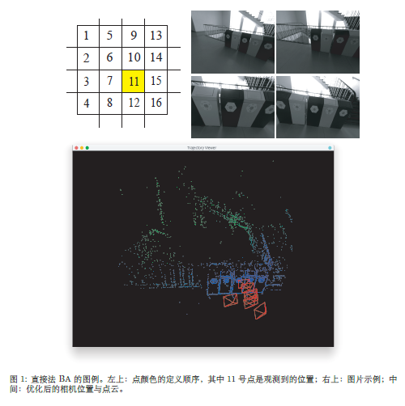

# 第七章作业

作者：曾是少年

## 二 Bundle Adjustment 

### 2.1 文献阅读(2 分)

我们在第五讲中已经介绍了Bundle Adjustment，指明它可以用于解PnP 问题。现在，我们又在后端中说明了它可以用于解大规模的三维重构问题，但在实时SLAM 场合往往需要控制规模。事实上，Bundle Adjustment 的历史远⽐我们想象的要长。请阅读Bill Triggs 的经典论文Bundle Adjustment: A Modern Synthesis（见paper/目录）1，了解BA 的发展历史，然后回答下列问题：

#### 1. 为何说Bundle Adjustment is slow 是不对的？

**答**：原文中如下所示：

---

“Optimization / bundle adjustment is slow”: Such statements often appear in papers introducing yet another heuristic Structure from Motion (SFM) iteration. The claimed slowness is almost always due to the unthinking use of a general-purpose optimization routine that completely ignores the problem structure and sparseness. Real bundle routines are much more efficient than this, and usually considerably more efficient and flexible than the newly suggested method (§6, 7). That is why bundle adjustment remains the dominant structure refinement technique for real applications, after 40 years of research.”

---

翻译：“优化/束调整运行缓慢”：这种陈述经常出现在介绍启发式SFM的论文中。他们把BA速度缓慢的原因归咎于通用的优化流程，该例程完全忽略了问题结构的稀疏性。实际的BA例程要高效很多，并且通常比新提出的方法（第6、7节）更加高效灵活。这就是经过40年的研究后，BA依然是实际应用中占主导地位的结构精炼技术。

#### 2. BA 中有哪些需要注意参数化的地方？Pose 和Point 各有哪些参数化⽅式？有何优缺点。

**答**：总结一下BA过程首先选择你想要的图里的节点与边的类型，确定它们的参数化形式；
1) 往图里加入实际的节点和边；
2) 选择初值，开始迭代；
3) 每一步迭代中，计算对应于当前估计值的雅可比矩阵和海塞矩阵；
4) 求解稀疏线性方程$H_kΔx=−b_k$，得到梯度方向；
5) 继续用GN或LM进行迭代。如果迭代结束，返回优化值。

##### Point 参数化方式

视觉SLAM中点的参数化表示包括三维坐标XYZ和你深度表示方法。

[Open VINS文档](https://link.zhihu.com/?target=http%3A//measurement%20update%20derivations%20%22%20camera%20measurement%20update/)中给出了五种特征参数化表示：Global XYZ，Global Inverse Depth，Anchored XYZ，Anchored Inverse Depth，Anchored Inverse Depth (MSCKF Version)，区别在于：

- **Global vs Anchored**：特征点的表示是全局坐标系的坐标还是局部相机坐标系的坐标。
- **XYZ vs Inverse Depth**：使用的XYZ还是逆深度
- **Two different Inverse Depth**：两种不同类型的逆深度参数

三维坐标XYZ：优点在于简单直观；缺点在于不能表示无穷远点；

逆深度：优点在于能够建模无穷远点；在实际应用中，逆深度也具有更好的数值稳定性。

##### Pose参数化方式

Pose的参数化表示包括欧拉角、四元数、变换矩阵。

1. 欧拉角 

   优点：容易理解，形象直观；三个值分别对应x、y、z轴的旋转角度。

   缺点：欧拉角这种方法是要按照一个固定的坐标轴的顺序旋转的，因此不同的顺序会造成不同结果；欧拉角旋转会造成**万向锁现象**，这种现象的发生就是由于上述固定的坐标轴旋转顺序造成的。由于万向锁的存在，欧拉旋转无法实现球面平滑插值。

2. 变换矩阵 

   优点：旋转轴可以是任意向量 

   缺点：旋转其实只需要知道一个向量+一个角度(共4自由度)，但矩阵却用了16个元素(消耗时间和内存)

3. 四元数 

   优点：可以避免万向锁问题；只需要一个4维的四元数就可以执行绕任意过原点的向量的旋转，方便快捷，在某些实现下比旋转矩阵效率更高；而且四元数旋转可以提供平滑插值。 

   缺点：比欧拉旋转稍微复杂了一点，因为多了一个维度，理解更困难，不直观。带有约束条件

#### 3. 本文写于2000 年，但是文中提到的很多内容在后面十几年的研究中得到了印证。你能看到哪些方向在后续工作中有所体现？请举例说明。

### 2.2 BAL-dataset

BAL（Bundle Adjustment in large）[数据集](http://grail.cs.washington.edu/projects/bal/)是⼀个⼤型BA 数据集，它提供了相机与点初始值与观测，你可以⽤它们进⾏Bundle Adjustment。现在，请你使⽤`g2o`，自己定义`Vertex `和`Edge`（不要使用自带的顶点类型，也不要像本书例程那边调用`Ceres`来求导），书写`BAL` 上的`BA` 程序。你可以挑选其中⼀个数据，运行你的BA，并给出优化后的点云图。

本题不提供代码框架，请独立完成。

提示：

1. 注意BAL 的投影模型⽐教材中介绍的多了个负号；

## 三 直接法的 Bundle Adjustment (5 分，约 3 小时)
### 3.1 数学模型
特征点法的 BA 以最小化重投影误差作为优化目标。相对的，如果我们以最小化光度误差为目标，就得到了直接法的 BA。之前我们在直接法 VO 中，谈到了如何用直接法去估计相机位姿。但是直接法亦可用来处理整个 `Bundle Adjustment`。下面，请你推导直接法 BA 的数学模型，并完成它的 g2o 实现。注意本题使用的参数化形式与实际的直接法还有⼀点不同，我们用 x, y, z 参数化每⼀个 3D 点，而实际的直接法多采用逆深度参数化 [1]。
本题给定 7 张图片，记为 0.png 至 6.png，每张图片对应的相机位姿初始值为 $T_i$，以 $T_{cw}$ 形式存储在 `poses.txt` 文件中，其中每⼀行代表⼀个相机的位姿，格式如之前作业那样：
$time, t_x, t_y, t_z, q_x, q_y, q_z, q_w$
平移在前，旋转（四元数形式）在后。同时，还存在⼀个 3D 点集 P，共 N 个点。其中每⼀个点的初始坐标记作 $p_i = [x, y, z]$ 。每个点还有自己的固定灰度值，我们用 16 个数来描述，这 16 个数为该点周围 4x4的小块读数，记作 $I(p)_i$，顺序见图 1 。换句话说，小块从 `u − 2`,` v − 2` 取到 `u + 1`,` v + 1`，先迭代 `v`。那么，我们知道，可以把每个点投影到每个图像中，然后再看投影后点周围小块与原始的 4x4 小块有多大差异。那么，整体优化目标函数为：
$$
\min\sum^7_{j=1}\sum^N_{i=1}\sum_W||I(p_i)-I_j(\pi(KT_jp_i))||^2_2
$$
即最小化任意点在任意图像中投影与其本⾝颜⾊之差。其中K 为相机内参（在程序内以全局变量形式给定），$\pi$为投影函数，$W$ 指代整个`patch`。下面，请回答：
#### 1. 如何描述任意一点投影在任意⼀图像中形成的error？

答：
$$
error = I(p_i)-I_j(\pi(KT_jp_j))
$$

#### 2. 每个error 关联几个优化变量？

答：每个error关联 T p两个优化变量

#### 3. error 关于各变量的雅可比是什么？

### 3.2 实现

下⾯，请你根据上述说明，使⽤ g2o 实现上述优化，并⽤ pangolin 绘制优化结果。程序框架见 `code/di-rectBA.cpp` ⽂件。实现过程中，思考并回答以下问题：

#### 1. 能否不要以 $[x, y, z]^T$ 的形式参数化每个点？

#### 2. 取 4x4 的 patch 好吗？取更大的 patch 好还是取小⼀点的 patch 好？

#### 3. 从本题中，你看到直接法与特征点法在 BA 阶段有何不同？

#### 4. 由于图像的差异，你可能需要鲁棒核函数，例如 Huber。此时 Huber 的阈值如何选取？

提示：

1. 构建 Error 之前先要判断点是否在图像中，去除⼀部分边界的点。

2. 优化之后，Pangolin 绘制的轨迹与地图如图 1 所示。

3. 你也可以不提供雅可比的计算过程，让 g2o 自己计算⼀个数值雅可比。

4. 以上数据实际取⾃ DSO[1]。

